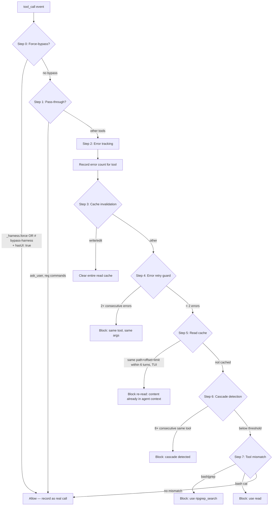

# Agent Harness

**Stop token waste before it happens.** Runtime tool call validation that redirects wrong tool usage, prevents error loops, blocks tool cascades, and caches redundant reads — all before the call reaches the LLM.

## Why

Every incorrect tool call costs tokens. Every error loop burns context window. Every redundant read repeats work. Agent Harness intercepts these patterns at the tool call boundary and blocks them before they execute.

**What it saves:**
- `bash | grep` → redirected to `ripgrep_search` (faster, structured, cached)
- `bash cat` → redirected to `read` (avoids spawning subshells)
- Error retry loops → blocked after 2 consecutive errors on same tool
- Same-tool cascades → 8+ consecutive `bash` calls are blocked with batching suggestion
- Redundant reads → re-reading the same path+offset+limit within 6 turns (30 s) is blocked with a hint in TUI mode; non-TUI passes through

Plus deterministic read caching across turns — the harness stores an existence marker per `path+offset+limit` and blocks a redundant re-read with a hint in TUI mode (non-TUI passes through). It stores no bytes: the content is assumed already in the agent's context.

## How it works

Agent Harness hooks into pi's `tool_call` event and runs every call through an 8-step validation pipeline before execution:

0. **Force-bypass gate** — Per-call escape hatch: `input._harness.force: true` or `# bypass-harness` comment annotation skips all guards. Requires `hasUI: true` (interactive session).
1. **Pass-through check** — Tools like `ask_user` pass through immediately (no validation overhead)
2. **Error tracking** — Failed calls are recorded; after 2+ errors on same tool, further calls are blocked
3. **Cache invalidation** — any `write`/`edit` or file-modifying `bash` clears the entire read cache
4. **Error retry guard** — If the same tool errored ≥2 times, subsequent calls are blocked with redirect suggestion
5. **Read cache** — Same path+offset+limit within 6 turns / 30 s → block with hint in TUI; non-TUI passes through. Marker only, no content stored.
6. **Cascade detection** — 8+ consecutive calls to the same tool triggers block with batching suggestion
7. **Tool mismatch** — `bash | grep` → `ripgrep_search`, `bash cat` → `read`

### Configuration

- Default rules are built-in; override via `.pi/harness-config.json`
- Per-tool thresholds configurable (`cascadeThreshold`, `passThrough`)
- Loaded per-session, `/reload` picks up changes

## Install

Part of Cheasee-Pi monorepo. Activated automatically when the extension directory is present.

## Requirements

- Pi Coding Agent ≥ 0.79.1 (for `isProjectTrusted`)
- No external dependencies

## Details

### Architecture

```
├── index.ts                  # Entry: session_start/tool_call/turn_start hooks, AgentHarness
├── agent-harness.ts          # AgentHarness class: handleToolCall, 8-step decision tree (step 0 = force-bypass)
├── lib/
│   ├── harness-rules.ts      # Rule definitions: cascade thresholds, pass-through tools, mismatches
│   ├── harness-state.ts      # Error tracking, cascade counter, read cache, turn tracking
│   ├── load-config.ts        # Load harness config from .pi/harness-config.json
│   ├── timed-map.ts          # Generic timed map with TTL-based eviction
│   └── constants.ts          # Default thresholds, tool lists
├── test/                     # Extensive test suite
└── bash-query.ts (../lib/)   # Bash classification: isBashSearch, isBashFileRead, isBashFileModify, hasBypassAnnotation
```

### Validation Pipeline



### Tool Mismatch Detection

| Pattern | Detected By | Redirect To |
|---------|-------------|-------------|
| `bash | grep` | `getBashSubKey()` token analysis | `ripgrep_search` |
| `bash cat` | `getBashSubKey()` | `read` |
| `bash rg` | `getBashSubKey()` | `ripgrep_search` |
| `bash find . -name` | `getBashSubKey()` | `ripgrep_search` / `bash ls` |

### Key Design Decisions

- **Force-bypass (Escape Hatch)** — Two per-call mechanisms: `input._harness.force: true` on any tool, or `# bypass-harness` comment annotation on bash commands. Both require `hasUI: true` (interactive session) to prevent automated abuse. `_harness` is consumed and stripped by the harness before the tool sees it. Force-bypassed calls count toward the cascade counter (recorded as real calls). Parsing for the bash annotation is token-aware (quoted-string immunity) and best-effort (heredocs/continuations fall through to false; use `_harness.force` for those edge cases).
- **Configurable per-tool thresholds** — `.pi/harness-config.json` allows per-tool `cascadeThreshold` (default 8) and `passThrough` flags.
- **Read caching with dual TTL (6 turns / 30 s)** — `TimedMap` stores an existence marker (`{ turn, timestamp }`) keyed by `path|offset|limit` for 6 turns or 30 s wall-clock. A hit returns no bytes: in TUI mode it blocks the re-read with a hint (content already in the agent's context); non-TUI passes through. Any `write`/`edit` or file-modifying `bash` clears the entire cache.
- **Error retry guard caps at 2** — First retry reasonable (transient). Second+ consecutive same-tool same-args blocked. Counter resets on turn_start.
- **Cascade detection resets on turn_start** — Prevents long-running multi-tool sequences from false positives.
- **Pass-through list** — `ask_user`, `ask_user_read`, registered tool registrations, command handlers exempt from validation.
- **Fail-safe defaults** — On config load failure, continues with hardcoded defaults. Never blocks due to config errors.

### Config Format (.pi/harness-config.json)

```json
{
  "tools": {
    "read": { "cascadeThreshold": 6, "passThrough": false },
    "bash": { "cascadeThreshold": 4, "passThrough": false },
    "ask_user": { "passThrough": true }
  }
}
```

### Force-Bypass Details

Two redundant signals for bypassing all guards on a per-call basis:

| Signal | Scope | Example |
|--------|-------|---------|
| `_harness.force: true` | Any tool | `input: { _harness: { force: true }, command: "grep foo" }` |
| `# bypass-harness` comment | Bash only | `command: "grep foo # bypass-harness"` |

Both signals require `hasUI: true` context (interactive session). If `hasUI` is `false` or `undefined`, the bypass is silently ignored and normal guards apply.

**`_harness` field contract:**
- Namespace-prefixed (`_harness`) to avoid collision with tool schemas
- Underscore prefix marks it as a reserved internal contract
- Always consumed and stripped by the harness before the tool executes — tools never see it
- Even on non-bypass paths (`force: false` or missing), `_harness` is still removed from input

**`# bypass-harness` token parsing:**
- Token-wise parser strips quoted-string literals before scanning
- Only checks the first logical line (heredoc and `\` continuation content falls through to false)
- Best-effort — for edge cases (heredocs, line continuations), use `_harness.force`

**Cascade counter semantics:**
- Force-bypassed calls **count as real calls** (inflate the cascade counter)
- Blocked calls (non-bypassed) still do NOT inflate the counter (Bug 5 invariant preserved)
- A bypassed call itself never triggers a cascade block (bypass gate runs before cascade check)

## License

MIT
