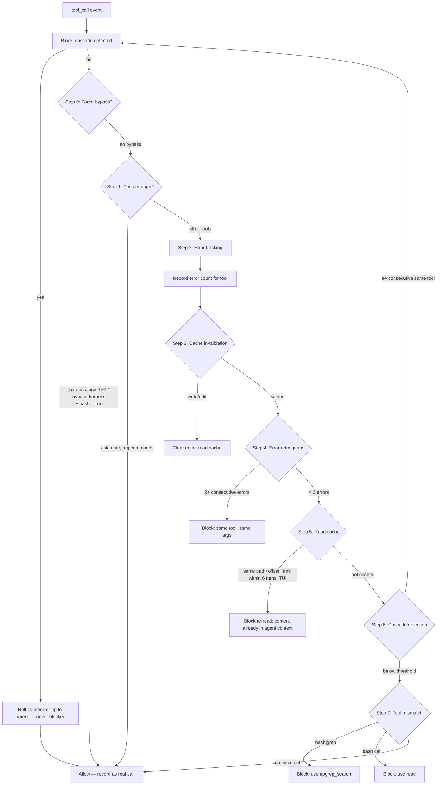

# Agent Harness

**Stop token waste before it happens.** Runtime tool call validation that redirects wrong tool usage, prevents error loops, blocks tool cascades, and caches redundant reads — all before the call reaches the LLM.

## Why

Every incorrect tool call costs tokens. Every error loop burns context window. Every redundant read repeats work. Agent Harness intercepts these patterns at the tool call boundary and blocks them before they execute.

**What it saves:**
- `bash | grep` → redirected to `ripgrep_search` (faster, structured, cached)
- `bash grep > file` → passes through (a write redirect is a write op; `ripgrep_search` cannot write output files)
- `bash cat` → redirected to `read` (avoids spawning subshells)
- Error retry loops → blocked after 2 consecutive errors on same tool
- Same-tool cascades → 8+ consecutive `bash` calls are blocked with batching suggestion
- Redundant reads → re-reading the same path+offset+limit within 6 turns (30 s) is blocked with a hint in TUI mode; non-TUI passes through

Plus deterministic read caching across turns — the harness stores an existence marker per `path+offset+limit` and blocks a redundant re-read with a hint in TUI mode (non-TUI passes through). It stores no bytes: the content is assumed already in the agent's context.

## How it works

Agent Harness hooks into pi's `tool_call` event and runs every call through a 9-step validation pipeline before execution:

0. **Nested attribution** — `ctx.executeTool()`-issued calls carry `parentToolCallId`; nested counts and errors roll up to the parent tool (resolved through a call-id index) and nested calls are never blocked
0. **Force-bypass gate** — Per-call escape hatch: `input._harness.force: true` or `# bypass-harness` comment annotation skips all guards. Requires `hasUI: true` (interactive session).
1. **Pass-through check** — Tools like `ask_user` pass through immediately (no validation overhead)
2. **Error tracking** — Failed calls are recorded; after 2+ errors on same tool, further calls are blocked
3. **Cache invalidation** — any `write`/`edit` or file-modifying `bash` clears the entire read cache
4. **Error retry guard** — If the same tool errored ≥2 times, subsequent calls are blocked with redirect suggestion
5. **Read cache** — Same path+offset+limit within 6 turns / 30 s → block with hint in TUI; non-TUI passes through. Marker only, no content stored.
6. **Cascade detection** — 8+ consecutive calls to the same tool triggers block with batching suggestion
7. **Tool mismatch** — `bash | grep` → `ripgrep_search`, `bash cat` → `read`

### Configuration

- Default rules are built-in; override via `.pi/harness-config.json`
- Per-tool thresholds configurable (`cascadeThreshold`, `passThrough`)
- Loaded per-session, `/reload` picks up changes

## Install

Part of Cheasee-Pi monorepo. Activated automatically when the extension directory is present.

## Requirements

- Pi Coding Agent ≥ 0.79.1 (for `isProjectTrusted`)
- Annotation-derived defaults and nested-call attribution require Pi ≥ 0.99.0 (`pi.getAllTools()` annotations, `parentToolCallId`, `ctx.executeTool()`). Both are **feature-detected**: on older floors the harness silently no-ops them and keeps legacy behavior.
- No external dependencies

## Details

### Architecture

```
├── index.ts                  # Entry: session_start/tool_call/turn_start hooks, AgentHarness, pi.getAllTools() port
├── agent-harness.ts          # AgentHarness class: handleToolCall, 9-step decision tree (step 0 = nested attribution + force-bypass)
├── lib/
│   ├── harness-rules.ts      # Rule definitions: cascade thresholds, pass-through tools, mismatches
│   ├── tool-annotations.ts   # Pure MCP-annotation → ToolMeta mapping (readOnly/destructive/openWorld)
│   ├── harness-state.ts      # Error tracking, cascade counter, read cache, call-id index, turn tracking
│   ├── load-config.ts        # Load harness config from .pi/harness-config.json
│   ├── timed-map.ts          # Generic timed map with TTL-based eviction
│   └── constants.ts          # Default thresholds, tool lists
├── test/                     # Extensive test suite
└── bash-query.ts (../lib/)   # Bash classification: isBashSearch, isBashFileRead, isBashFileModify, hasBypassAnnotation
```

### Validation Pipeline


```mermaid
flowchart TD
    A[tool_call event] --> N{Step 0.5: Nested call?
parentToolCallId set}
    N -- yes --> N2[Roll count/error up to parent — never blocked]
    N2 --> C
    N -- no --> B{Step 0: Force-bypass?}
    B -- "_harness.force OR # bypass-harness\n+ hasUI: true" --> C[Allow — record as real call]
    B -- no bypass --> D{Step 1: Pass-through?}
    D -- ask_user, reg commands --> C
    D -- other tools --> E[Step 2: Error tracking]
    E --> F[Record error count for tool]
    F --> G{Step 3: Cache invalidation}
    G -- write/edit --> H[Clear entire read cache]
    G -- other --> I{Step 4: Error retry guard}
    I -- 2+ consecutive errors --> J[Block: same tool, same args]
    I -- < 2 errors --> K{Step 5: Read cache}
    K -- same path+offset+limit within 6 turns, TUI --> L[Block re-read: content already in agent context]
    K -- not cached --> M{Step 6: Cascade detection}
    M -- 8+ consecutive same tool --> N[Block: cascade detected]
    M -- below threshold --> O{Step 7: Tool mismatch}
    O -- bash|grep --> P[Block: use ripgrep_search]
    O -- bash cat --> Q[Block: use read]
    O -- no mismatch --> C
```

### Tool Mismatch Detection

| Pattern | Detected By | Redirect To |
|---------|-------------|-------------|
| `bash | grep` | `getBashSubKey()` token analysis | `ripgrep_search` |
| `bash cat` | `getBashSubKey()` | `read` |
| `bash rg` | `getBashSubKey()` | `ripgrep_search` |
| `bash find . -name` | `getBashSubKey()` | `ripgrep_search` / `bash ls` |

### Key Design Decisions

- **Force-bypass (Escape Hatch)** — Two per-call mechanisms: `input._harness.force: true` on any tool, or `# bypass-harness` comment annotation on bash commands. Both require `hasUI: true` (interactive session) to prevent automated abuse. `_harness` is consumed and stripped by the harness before the tool sees it. Force-bypassed calls count toward the cascade counter (recorded as real calls). Parsing for the bash annotation is token-aware (quoted-string immunity) and best-effort (heredocs/continuations fall through to false; use `_harness.force` for those edge cases).
- **Annotation-derived defaults** — On `session_start` the harness injects a lazy port over `pi.getAllTools()`. At each `tool_call`, a tool with no explicit config or hardcoded entry has its default `ToolMeta` derived from the tool's MCP `annotations`: `readOnlyHint` tools skip error tracking (`trackErrors: false`), `destructiveHint` tightens the cascade threshold, `openWorldHint` loosens it. Missing hints are **never treated as safe**: `destructiveHint ?? true`, `openWorldHint ?? true`, and read-only only on `readOnlyHint === true`. Annotations are advisory/unverified — explicit config always wins. Precedence: config `toolMeta` > hardcoded `TOOL_META` > annotation-derived > generic default. Resolved lazily per call (no session snapshot), and feature-detected: on Pi < 0.99.0 (no `annotations`) the port yields nothing and legacy behavior holds.
- **Nested-call attribution** — `ctx.executeTool()`-issued calls flow through the same `tool_call` handler with a pi-assigned `<parent>/<n>` id and `parentToolCallId`. The harness resolves the parent through a turn-bounded call-id index (rather than string-splitting the synthetic id, which is ambiguous at depth ≥2) and rolls the nested count/error up under the parent's composite counter identity (incl. bash sub-key) so per-parent thresholds don't misfire. A nested call re-asserts the parent as the active chain key — it fires during the parent's execution, so an interleaved sibling must not hide the roll-up. Nested errors inherit the parent's effective `trackErrors`: a read-only parent is never error-blocked by nested failures, while explicit config `trackErrors: true` restores it. Nested calls are **never blocked** — a nested block would break the parent tool instead of teaching the model. An unmapped parent id is ignored. Step 2.5 cache invalidation still runs for nested writes.
- **Configurable per-tool thresholds** — `.pi/harness-config.json` allows per-tool `cascadeThreshold` (default 8) and `passThrough` flags. Top-level `cascadeThreshold` sets the global default; `toolMeta.<tool>.cascadeThreshold` overrides it for that tool.
- **Read caching with dual TTL (6 turns / 30 s)** — `TimedMap` stores an existence marker (`{ turn, timestamp }`) keyed by `path|offset|limit` for 6 turns or 30 s wall-clock. A hit returns no bytes: in TUI mode it blocks the re-read with a hint (content already in the agent's context); non-TUI passes through. Any `write`/`edit` or file-modifying `bash` clears the entire cache.
- **Error retry guard caps at 2** — First retry reasonable (transient). Second+ consecutive same-tool same-args blocked. Counter resets on turn_start.
- **Cascade detection resets on turn_start** — Prevents long-running multi-tool sequences from false positives.
- **Pass-through list** — `ask_user`, `ask_user_read`, registered tool registrations, command handlers exempt from validation.
- **Fail-safe defaults** — On config load failure, continues with hardcoded defaults and warns the user (TUI notify / RPC message / console.error). Never blocks due to config errors, never silently discards the config.

### Config Format (.pi/harness-config.json)

Top-level `cascadeThreshold` is the global default; `toolMeta.<tool>.cascadeThreshold` overrides it per tool.

```json
{
  "toolMeta": {
    "read": { "cascadeThreshold": 6, "passThrough": false },
    "bash": { "cascadeThreshold": 4, "passThrough": false },
    "ask_user": { "passThrough": true }
  },
  "cascadeThreshold": 8
}
```

Unknown top-level keys are rejected: the config is discarded, the harness warns, and default rules apply.

### Force-Bypass Details

Two redundant signals for bypassing all guards on a per-call basis:

| Signal | Scope | Example |
|--------|-------|---------|
| `_harness.force: true` | Any tool | `input: { _harness: { force: true }, command: "grep foo" }` |
| `# bypass-harness` comment | Bash only | `command: "grep foo # bypass-harness"` |

Both signals require `hasUI: true` context (interactive session). If `hasUI` is `false` or `undefined`, the bypass is silently ignored and normal guards apply.

**`_harness` field contract:**
- Namespace-prefixed (`_harness`) to avoid collision with tool schemas
- Underscore prefix marks it as a reserved internal contract
- Always consumed and stripped by the harness before the tool executes — tools never see it
- Even on non-bypass paths (`force: false` or missing), `_harness` is still removed from input

**`# bypass-harness` token parsing:**
- Token-wise parser strips quoted-string literals before scanning
- Only checks the first logical line (heredoc and `\` continuation content falls through to false)
- Best-effort — for edge cases (heredocs, line continuations), use `_harness.force`

**Cascade counter semantics:**
- Force-bypassed calls **count as real calls** (inflate the cascade counter)
- Blocked calls (non-bypassed) still do NOT inflate the counter (Bug 5 invariant preserved)
- A bypassed call itself never triggers a cascade block (bypass gate runs before cascade check)

## License

MIT
