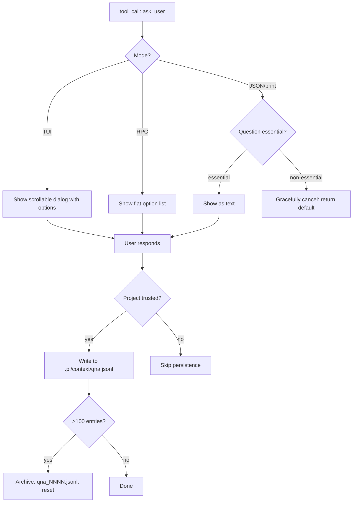

# @agentcastle/ask-user

**Ask the user instead of guessing.** When the LLM needs a decision, preference, or clarification, it calls `ask_user` — and you respond through a structured dialog. No more hallucinated defaults.

## Features

- **`ask_user` tool** — Two dialog modes:
  - `choice` — Pick from predefined options (with recommendation marker)
  - `freetext` — Open-ended input
- **Mode-aware dispatch** — Questions adapt to the current `ctx.mode`:
  - `tui` — Scrollable dialog with option highlighting (uses `ctx.ui.custom`)
  - `rpc` — Flat option list via `ctx.ui.select` (compatible with RPC clients)
  - `json` / `print` — Cancel non-essential questions gracefully (no interactive UI)
- **Trust-gated persistence** — Q&A history is only written when `ctx.isProjectTrusted()` is true. In untrusted contexts, answers are returned in tool content but never persisted to disk.
- **`ask_user_read` tool** — LLM retrieves past Q&A entries (by id, list, or text search). Returns empty with `untrusted: true` flag when project trust is not granted.
- **`/qna` command** — Browse logged Q&A history. Gated behind project trust.
- **Structured response format** — All tool responses include `format: "qna-result-v1"` in `details` for typed downstream consumption. Untrusted responses include `untrusted: true`.
- **Persistent log** — All interactions saved to `.pi/context/qna.jsonl` (legacy `.csv` auto-migrated at session start if project trust is granted).

## How it works

1. The LLM needs to make a decision (e.g. "which framework?" or "confirm destructive action")
2. It calls `ask_user` with typed options or open prompt
3. The question UI adapts to the current mode (TUI dialog, RPC select, or graceful cancel)
4. Your answer is returned in tool content; persistence depends on project trust
5. Future turns can retrieve past answers via `ask_user_read` or `/qna`

## Install

```bash
pi install npm:@agentcastle/ask-user
```

Then run `/reload` or restart pi.

## Usage

The LLM uses `ask_user` automatically when it needs input. You can also browse history:

```
/qna               List recent Q&A entries
/qna list 5        List last 5 entries
/qna get 3         Show entry #3 in detail
/qna query search  Find entries matching text
```

## Requirements

- Pi Coding Agent ≥ v0.79.1
- No external dependencies — all peer deps are pi-provided.

## Details

### Architecture

Single-file extension with dual tools and trust-gated persistence:

```
├── index.ts  # Entry: register ask_user and ask_user_read tools, Q&A lifecycle
└── test/     # Unit tests
```

Core concerns:
- **`ask_user` tool** — Choice and freetext modes with mode-adaptive rendering
- **`ask_user_read` tool** — Retrieve past Q&A entries by id, list, or text query
- **Persistence manager** — JSONL-based Q&A log with auto-rotation at 100 entries
- **Trust gate** — History only written when `ctx.isProjectTrusted()` is true
- **Mode adaptation** — TUI gets scrollable dialog, RPC gets flat option list, JSON/print cancel non-essential questions

### Execution Flow



### Mode-Specific Rendering

| Mode | ask_user | ask_user_read |
|------|----------|---------------|
| TUI | Scrollable dialog with option buttons | Inline list with IDs |
| RPC | Flat numbered list | Structured JSON |
| JSON | Cancel non-essential; text for essential | Structured JSON |
| Print | Same as JSON | Same as JSON |

### Choice Mode Mechanics

- Options: `label`, `value`, `recommended`
- Exactly one option must have `recommended: true`
- `disableOther: true` suppresses automatic "Other" option (for quizzes)
- At least 3 options required ("Other" appended automatically unless disabled)

### Key Design Decisions

- **Graceful cancellation** — Non-essential questions return sensible default in JSON/print instead of blocking.
- **Recommendation marker** — Guides user without making choice mandatory.
- **History trust model** — Answers stored only on trusted projects. Dialog works but history not persisted on untrusted.
- **`ask_user_read` trust awareness** — Returns `untrusted: true` when trust not granted.
- **Auto-migration from CSV** — Legacy `.pi/context/qna.csv` auto-converted to JSONL on first access. Original renamed to `.csv.migrated`.

### Persistence Details

```
.pi/context/
  qna.jsonl          # Active log (max 100 entries)
  qna_0001.jsonl     # Archived
  qna_0002.jsonl     # Archived
```

- Auto-rotation at 100 entries
- Each entry: `{ id, timestamp, question, answer, mode, trusted }`
- `/qna` command for browsing (gated behind project trust)

## License

MIT
