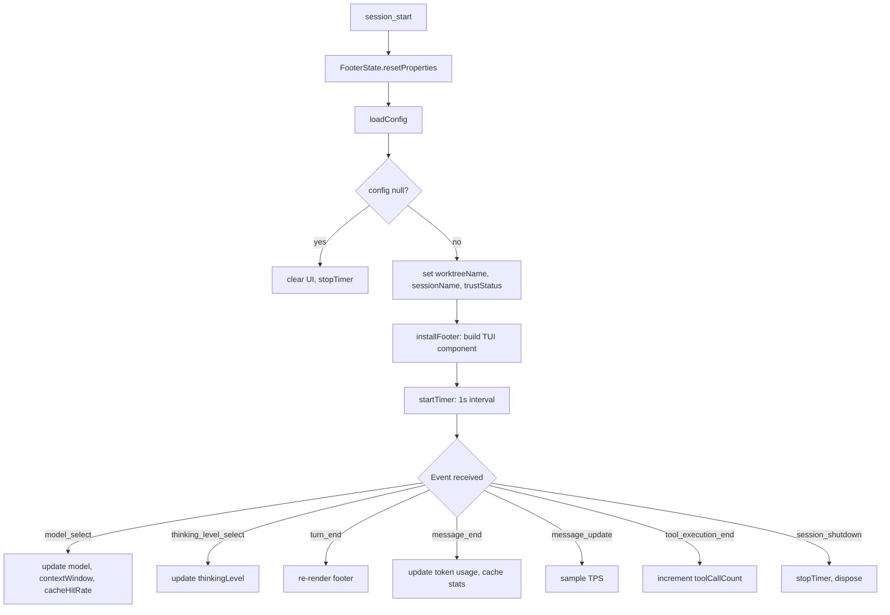

# Context Info

**Rich TUI status bar.** Replaces pi's default footer with real-time information — git branch, active model, token usage, TPS during streaming, cache hit rate, session name, trust status, and more.

## Why

pi's built-in footer is minimal. Context Info turns it into a mission-control dashboard:

- **Git branch** — current worktree name (critical when running multi-worktree pipelines)
- **Model** — active model name with context window
- **Token usage** — running token count with configurable thresholds (color-coded: green → yellow → red)
- **TPS** — tokens-per-second during streaming, sampled from `message_update` events
- **Cache stats** — cache read/write breakdown and hit rate percentage
- **Session info** — session name (from `pi.getSessionName()`), session ID
- **Thinking level** — current thinking mode (low/medium/high)
- **Trust status** — project trusted/untrusted indicator
- **Live timer** — session duration counter
- **Tool call counter** — running count of tool executions this session

Plus `/explain-extensions`, `/explain-prompts`, `/explain-skills` commands listing all active extensions, prompts, and skills with descriptions.

## How it works

1. **Session start** — `FooterState` is created, reads config from `.pi/settings.json` (in `contextInfo` section), detects git worktree name, captures session name and trust status
2. **Footer render** — Custom footer is installed via `ctx.ui.setFooter()`, replacing the default pi footer. Only active in TUI mode.
3. **Event hooks** — Updates footer reactively on:
   - `model_select` — new model, context window
   - `thinking_level_select` — thinking mode change
   - `turn_end` — refresh all counters
   - `message_end` — capture token usage + cache stats from raw event
   - `message_update` — sample streaming tokens for TPS calculation
   - `tool_execution_end` — increment tool call counter
4. **Timer** — Interval-based timer updates the session duration display every second
5. **Session end** — Timer stops, footer disposed

### Status widgets

| Widget | Shows | Updates |
|--------|-------|---------|
| `contextUsage` | Token usage with color thresholds | On every message_end |
| `contextCache` | Cache read/write + hit rate | On message_end (when cache data available) |
| `contextFooter` | Full footer bar | On any relevant event |
| `caveman` | Caveman level indicator | On level change |
| Themed working indicator | Animated dot pulse | During agent execution |

### Configuration (optional)

In `.pi/settings.json`:

```json
{
  "contextInfo": {
    "showTimer": true,
    "showWorktree": true,
    "showToolCount": true,
    "thresholds": {
      "tokenGreen": 10000,
      "tokenYellow": 30000,
      "tokenRed": 60000
    }
  }
}
```

## Install

Part of Cheasee-Pi monorepo. Activated automatically.

## Requirements

- Pi Coding Agent ≥ 0.79.1 (for `isProjectTrusted`, `mode` in context)
- Works with any TUI theme (uses theme colors from ctx.ui.theme)

## Details

### Architecture

Reactive footer system with event-driven updates:

```
├── index.ts            # Entry: event hooks, state management, /explain-* commands
├── footer.ts           # installFooter: builds TUI footer component tree
├── footer-state.ts     # FooterState: mutable state container with render triggers
├── config.ts           # Load config from .pi/settings.json
├── types.ts            # ThresholdEntry, TpsSample, FooterConfig interfaces
├── git-helpers.ts      # Worktree name detection
├── telemetry.ts        # tryEmit: lightweight telemetry
├── extensions.ts       # List active extensions
├── prompts.ts          # List available prompt templates
├── skills.ts           # List available skills
├── explain.ts          # createExplainCommand factory
├── cheasee-pi-info.ts  # /cheasee-pi-info command
└── test/               # Unit tests
```

### Footer State Machine



### Footer Component Tree

```
[Git branch] [Model] [Thinking] [timer] [Tokens used/max] [TPS] [Cache hit rate] [Session] [Trust] [Tool calls]
```

Each segment is a reactive Widget that updates when its backing `Reactive` value changes.

### Key Design Decisions

- **FooterState lifecycle** — Created on `session_start`, disposed on `session_shutdown`. Previous disposed before new to prevent stale `ctx` closures.
- **Working indicator** — Custom dot pulse (`·` `•` `●` `•`) instead of standard spinner.
- **TPS sampling** — On `message_update`, samples streaming output tokens via deduplicated key extraction.
- **Cache hit rate** — `cacheRead / (cacheRead + cacheWrite)` on each `message_end`. Reset on model change.
- **Quiet startup** — `quietStartup: true` suppresses startup hint and working indicator.
- **Explain commands** — Widgets auto-cleared on first `input`/`before_agent_start`/`user_bash` event.
- **Supervisor integration** — Exported `setSupervisorIssueData`/`clearSupervisorIssueData` for TUI footer display.
- **Timer** — `setInterval` at 1s, cleared on shutdown.

### Event to Footer Update Map

| Event | Fields Updated |
|-------|---------------|
| `session_start` | worktreeName, sessionName, trustStatus, sessionId |
| `model_select` | modelName, contextWindow, cacheHitRate |
| `thinking_level_select` | thinkingLevel |
| `turn_end` | sessionName |
| `message_end` | tokensUsed, tokensMax, cacheRead/Write, hitRate |
| `message_update` | TPS samples |
| `tool_execution_end` | toolCallCount |

## License

MIT
