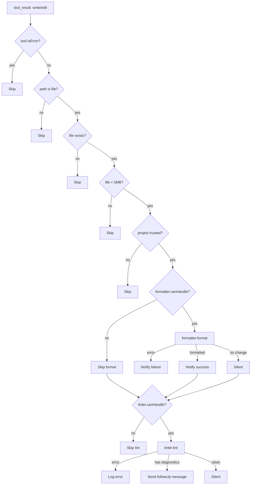

# Format on Save

**Auto-formats and lints your code after every write/edit — no manual step needed.** Runs Prettier formatting and ESLint diagnostics asynchronously after every `write` or `edit` tool result.

## Why

Manually running formatters and linters wastes tokens and context. Format on Save runs them automatically:

- Prettier formatting after every file write — consistent code style without asking
- ESLint diagnostics reported as follow-up — catches issues early, before the supervisor Auditor step
- Non-blocking — formatting errors don't crash the session or block the agent
- Mode-adaptive notifications — TUI gets toast notifications, RPC gets `followUp` messages, JSON/print stay silent

The trust gate ensures formatting only runs on projects you've explicitly trusted — preventing untrusted workspace configs from running arbitrary formatter commands.

## How it works

1. **Trigger** — After every `write` or `edit` tool call (via `tool_result` event), the extension checks if the target file exists and is not too large (>5MB skipped)
2. **Trust check** — `ctx.isProjectTrusted()` gates all formatting and linting. Untrusted projects skip entirely
3. **Format** — Prettier is called on the file. If formatting changes were made, a notification is sent
4. **Lint** — ESLint runs on the file. If diagnostics are found, a `followUp` message is sent to the LLM with structured diagnostic output
5. **Notifications** — TUI: `ctx.ui.notify()` toasts. RPC: `pi.sendUserMessage()` follow-up. JSON/print: console.error only

### Format flow

```
write/edit tool call
    │
    ├─ File exists? ─── No → skip
    │
    ├─ Size ≤ 5MB? ─── No → skip
    │
    ├─ Trusted? ────── No → skip
    │
    ├─ Prettier format
    │     ├─ Changed → notify "[mode] Formatted: path"
    │     └─ No change → silent
    │
    └─ ESLint lint
          ├─ Diagnostics found → followUp message to LLM
          └─ No diagnostics → silent
```

### Trust model

- **Trusted** — Format + lint run automatically
- **Not trusted** — Skipped entirely. Prevents attacker-controlled `.prettierrc` or `eslint.config` from executing arbitrary commands

## Install

Part of Cheasee-Pi monorepo. Activated automatically.

## Requirements

- Pi Coding Agent ≥ 0.79.1 (for `isProjectTrusted()`)
- Prettier and ESLint installed in the project (devDependencies)
- Project must be trusted (`/trust`)

## Details

### Architecture

Adapter pattern with pluggable Formatter/Linter ports:

```
├── index.ts               # Entry: registerHandler, tool_result event wiring
├── eslint.mts             # formatEslintDiagnostics: diagnostic message formatting
├── eslint-adapter.mts     # EslintLinter: ESLint adapter (dynamic import)
├── prettier-adapter.mts   # PrettierFormatter: Prettier adapter (dynamic import)
├── ports.mts              # Formatter, Linter interfaces
└── test/                  # Tests
```

### Execution Flow



### Key Design Decisions

- **Non-blocking advisory** — Format/lint errors never crash session. The write/edit already succeeded.
- **Dynamic imports for adapters** — Missing prettier/eslint handled gracefully inside adapters.
- **Trust gate** — Untrusted projects skip entirely. Prevents arbitrary formatter commands from project-local config.
- **Mode-adaptive notifications** — TUI: `ctx.ui.notify()`. RPC: `pi.sendUserMessage(followUp)`. JSON/print: console.error only.
- **Size gate (5MB)** — Prevents trying to format/lint large generated files.
- **File path heuristic** — `looksLikeFilePath()` checks for `.ts`, `.tsx`, `.js`, `.mjs`, etc. Rejects `pip install` or `npm i`.
- **ESLint config error prefixing** — Config error patterns get `[config error]` prefix in logs.
- **Diagnostic followUp deduplication** — Only sends followUp when `diagnostics.length > 0`.

### Adapter Ports

```typescript
interface Formatter {
  canHandle(filePath: string): boolean;
  format(filePath: string): Promise<{ formatted: boolean; error?: string }>;
}

interface Linter {
  canHandle(filePath: string): boolean;
  lint(filePath: string): Promise<{ diagnostics: LintDiagnostic[]; error?: string }>;
}
```

## License

MIT
