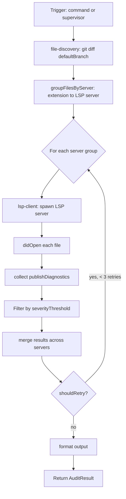

# @agentcastle/lsp-auditor

**Catch code quality issues before they reach review.** Runs Language Server Protocol (LSP) diagnostics on files changed since your default branch — errors, warnings, and hints — as an automated pre-commit audit step.

## Features

- **`/lsp-auditor` command** — Manually trigger LSP diagnostics on modified files
- **Supervisor integration** — Called automatically by the supervisor extension during the Audit stage
- **Multi-language support** — TypeScript, JavaScript, TSX, JSX, Python, Rust, Go, and more via configurable server mappings
- **Per-server severity thresholds** — Filter diagnostics by severity per language server (e.g., errors only for strict checks)
- **Retry logic** — Up to 3 retry attempts per audit, backed by session-stored retry counters
- **File grouping** — Groups files by matching LSP server (e.g., all `.ts` files go to `typescript-language-server`)
- **Structured diagnostics output** — Returns `file`, `line`, `column`, `severity`, and `message` for every finding
- **Git-aware** — Only audits files modified since the default branch
- **Project trust gate** — Skips LSP audit when project is not trusted, preventing untrusted workspace config from weaponizing LSP servers
- **Mode-adaptive output** — `/lsp-auditor` command output adapts per `ctx.mode`: TUI gets clickable `file://` URIs, RPC/JSON gets structured JSON, Print gets plain text
- **Args parsing support** — `/lsp-auditor` command handler uses `parseArgs` for future subcommand support (e.g., `/lsp-auditor --files src/`)

## How it works

1. The audit is triggered — either manually via `/lsp-auditor` or automatically by the supervisor extension
2. If triggered automatically, the extension first checks project trust via `ctx.isProjectTrusted()` — untrusted projects skip the audit with a warning
3. The extension runs `git diff <defaultBranch> --name-only` to find changed files
4. Files are grouped by matching LSP server mapping (file extension → LSP command)
5. For each group, the extension spawns the LSP server, opens every file via `didOpen`, and collects `publishDiagnostics` notifications
6. Diagnostics are filtered by per-server severity threshold and merged into a single report
7. Results include all errors/warnings with file paths, line numbers, and messages
8. If diagnostics exceed severity thresholds, the audit can block progression to the next stage

## Install

```bash
pi install npm:@agentcastle/lsp-auditor
```

Then run `/reload` or restart pi.

## Usage

### Manual trigger

```
/lsp-auditor
```

Output adapts to your current mode:
- **TUI mode** — Clickable `file://` URIs with notification via `ctx.ui.notify()`
- **RPC/JSON mode** — Structured JSON with `proceed`, `note`, and `diagnostics` fields
- **Print mode** — Plain text summary

### Supervisor integration

The supervisor extension calls `runPreAudit()` automatically during the Audit stage. No additional configuration needed.

If the project is not trusted, `runPreAudit()` returns `{ proceed: true }` with a warning note — LSP audit is skipped, matching the VS Code Restricted Mode precedent.

### Configuration (optional)

In `.pi/settings.json`:

```json
{
	"lspAuditor": {
		"servers": [
			{
				"extensions": [".ts", ".tsx", ".js", ".jsx"],
				"command": "typescript-language-server",
				"args": ["--stdio"],
				"severityThreshold": "warning"
			}
		]
	}
}
```

Default server mappings:
| Extension | LSP Command |
|-----------|-------------|
| `.ts`, `.tsx`, `.js`, `.jsx` | `typescript-language-server --stdio` |
| `.py` | `pylsp` |
| `.rs` | `rust-analyzer` |
| `.go` | `gopls` |

Override `severityThreshold` per server: `"error"`, `"warning"`, or `"info"` (default: `"info"`).

## API

### `checkProjectTrust(ctx)`

Check if the project is trusted before starting LSP servers. Returns `{ trusted: true }` or `{ trusted: false, note: string }`.

```typescript
import { checkProjectTrust } from "@agentcastle/lsp-auditor";

const result = checkProjectTrust(ctx);
if (!result.trusted) {
  // Skip LSP audit
}
```

### `formatForMode(diagnostics, mode, worktreePath, hasUI)`

Format diagnostics for the given execution mode. Returns a string or `StructuredDiagnostics` object.

```typescript
import { formatForMode } from "@agentcastle/lsp-auditor";

// TUI with UI: string with file:// URIs
const tuiOutput = formatForMode(diags, "tui", "/workspace", true);

// RPC/JSON: StructuredDiagnostics object
const structured = formatForMode(diags, "rpc", "/workspace", false);
// { files: [{ path: "/workspace/src/app.ts", issues: [{ line, col, severity, message }] }] }
```

### `StructuredDiagnostics`

```typescript
interface StructuredDiagnostics {
  files: Array<{
    path: string;
    issues: Array<{
      line: number;
      col: number;
      severity: string;
      message: string;
    }>;
  }>;
}
```

## Requirements

- Pi Coding Agent v0.78.0+ (for `parseArgs` export)
- Pi Coding Agent v0.78.1+ (for `ctx.mode`)
- Pi Coding Agent v0.79.1+ (for `ctx.isProjectTrusted()`)
- LSP servers installed on PATH for the languages you audit (e.g., `typescript-language-server`, `pylsp`, `rust-analyzer`, `gopls`)
- `vscode-jsonrpc` (npm dependency, installed automatically)
- Git repository with a default branch

## Details

### Architecture

Multi-server LSP orchestrator with file discovery and retry logic:

```
├── index.ts              # Entry: command registration, runPreAudit export
├── run-pre-audit.ts      # Orchestrator: discover files, group by server, audit each group
├── lsp-client.ts         # LSP client: spawn server, didOpen, collect publishDiagnostics
├── server-mappings.ts    # Extension to server mapping (.ts to typescript-language-server, .py to pylsp, etc.)
├── file-discovery.ts     # git diff file discovery + extension grouping
├── formatting.ts         # Diagnostic formatting, severity filtering
├── settings.ts           # Read .pi/settings.json for defaultBranch
├── retry.ts              # Retry logic: countRetryAttempts, shouldRetry, MAX_RETRIES=3
├── output-adapter.ts     # Mode-adaptive output formatting (TUI/RPC/JSON/print)
├── types.ts              # LspDiagnostic, ServerMapping, AuditResult interfaces
└── test/                 # Unit + integration tests
```

### Execution Flow



### Server Mappings

| Extension | LSP Server |
|-----------|-----------|
| `.ts`, `.tsx`, `.js`, `.jsx` | `typescript-language-server --stdio` |
| `.py` | `pylsp` |
| `.rs` | `rust-analyzer` |
| `.go` | `gopls` |

### Key Design Decisions

- **File discovery via `git diff`** — Only checks modified files vs defaultBranch. `git diff <defaultBranch> --name-only`.
- **Per-server severity threshold** — Each server configures `severityThreshold` (error/warning/info). Diagnostics below threshold filtered out.
- **Retry with session-stored counters** — Up to 3 retries per server group. `shouldRetry()` checks both attempt count and transient vs permanent error types.
- **Trust gate** — Untrusted projects skip entirely (returns `{ proceed: true }` with warning). Matches VS Code Restricted Mode.
- **Passive by default** — No lifecycle hooks. Activated by supervisor's `runPreAudit()` or manual `/lsp-auditor`.
- **Spawn + didOpen protocol** — LSP servers spawned on-demand, files opened via `didOpen`, diagnostics from `publishDiagnostics` notifications.

### Retry Logic

```typescript
MAX_RETRIES = 3

function shouldRetry(attempts: number, error: Error): boolean {
  if (attempts >= MAX_RETRIES) return false;
  // Only retry transient errors
  return error.message.includes('ECONNREFUSED') ||
         error.message.includes('ETIMEDOUT') ||
         error.message.includes('process exited');
}
```

## License

MIT
