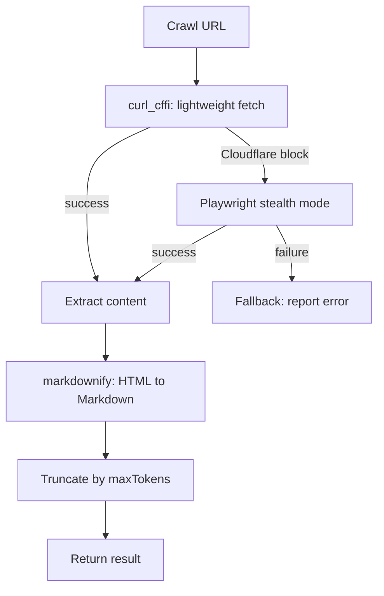

# Web Crawl (scrapling)

**Crawl web pages behind Cloudflare and extract content as Markdown.** Uses Scrapling with progressive fetching — starts lightweight (`curl_cffi`), escalates to Playwright stealth when blocked.

## Why

Web crawling for AI agents is notoriously fragile — bot detection, Cloudflare challenges, JavaScript rendering. Scrapling handles all of this transparently:

- **Automatic Cloudflare bypass** — progressive fetching: lightweight curl_cffi → Playwright with stealth patches
- **Markdown extraction** — HTML cleaned via `markdownify`, removes ads, nav bars, footers
- **Token budget** — `maxTokens` parameter caps output per page, truncates with notice
- **Concurrency limit** — 2 concurrent crawls max to protect memory (configurable in `config.json`)
- **Auto venv setup** — Python venv with dependencies installed on first call, cached thereafter
- **Graceful fallback** — if `markdownify` fails, raw `html2text` is used as fallback

## How it works

1. **Venv setup** — On first call, creates `.pi/scrapling-venv/` and `pip install scrapling[fetchers] markdownify`
2. **URL validation** — `new URL(url)` validates the URL before any fetch
3. **Cache check** — TODO: caching is planned but not yet implemented
4. **Acquire lock** — Semaphore ensures ≤2 concurrent crawls (configurable in `config.json`)
5. **Crawl** — Python subprocess runs Scrapling with progressive fetching:
   - First tries lightweight `curl_cffi` fetch
   - If Cloudflare blocks, escalates to Playwright with stealth
   - Extracts content as Markdown via `markdownify`
6. **Result** — Returns formatted markdown with source URL and fetch method per page

### Flow

```
web_crawl(url)
    │
    ├─ URL valid? ── No → throw "Invalid URL"
    │
    ├─ Venv exists? ── No → create venv + install deps
    │
    ├─ Acquire crawl lock (max 2 concurrent)
    │
    ├─ Python subprocess
    │     ├─ curl_cffi (lightweight)
    │     ├─ Blocked? → Playwright stealth
    │     └─ Extract markdown via markdownify
    │
    └─ Return formatted results
```

### Configuration (`config.json`)

```json
{
  "maxConcurrentCrawls": 2,
  "defaultMaxPages": 1,
  "defaultMaxTokens": 0
}
```

## Install

Part of Cheasee-Pi monorepo. Activated automatically.

## Requirements

- Python 3.10+
- Internet access (pip install on first call)
- ~200MB disk for venv (Playwright Chromium browser download)

## Details

### Architecture

Concrete adapter pattern with injectable crawl factory:

```
├── index.ts           # Entry: tool registration, URL validation, concurrency semaphore (max 2)
├── python-adapter.ts  # PythonAdapter: subprocess orchestration via pi.exec, exports CrawlFn type
├── python-script.ts   # Inline Python crawler script using scrapling library
├── venv-setup.ts      # Auto-create .pi/scrapling-venv + pip install scrapling[fetchers] + markdownify
├── types.ts           # CrawlResult, CrawlPage types
└── test/              # Unit + integration tests
```

### Progressive Fetch Strategy



### Key Design Decisions

- **Concurrency semaphore (max 2)** — Protects 8GB RAM. Polling loop with 1000ms interval.
- **Progressive escalation** — Starts lightweight (`curl_cffi`). If Cloudflare blocks, escalates to Playwright stealth. Never runs both.
- **Auto-installing venv** — On first call, creates `.pi/scrapling-venv/`. If Chromium errors, `rm -rf` and retry — auto-recreates.
- **maxPages cap at 10** — Hard upper bound prevents runaway crawling. Default 1.
- **maxTokens truncation** — Content truncated with notice. 0 = no limit.
- **URL validation via `new URL()`** — Rejects invalid URLs early. No protocol restriction.

### Output Format

```
--- https://example.com (via curl_cffi) ---
# Page Title
Content extracted as Markdown...
```

## License

MIT
