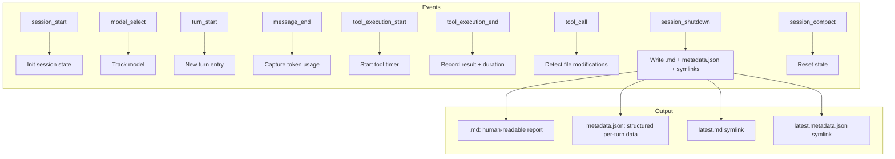

# Session Logger

**Rich session reports beyond basic JSONL.** Generates Markdown reports alongside pi's standard `.jsonl` session files — with per-turn token breakdown, tool execution stats, file modifications, sub-agent output, and error summaries.

## Why

pi's built-in `.jsonl` session logs are machine-readable but hard to review. Session Logger adds:

- **Markdown reports** — Human-readable `.md` files with structured sections per turn
- **Tool execution metrics** — Per-tool call count, token cost, duration, success/failure ratio
- **Per-turn breakdown** — Token in/out per turn, thinking tokens, tool tokens
- **Sub-agent output** — Supervisor pipeline agents (developer, auditor, researcher, test-designer) get dedicated sections with status, tool count, token count, duration, audit score
- **File modification tracking** — Every `write`/`edit` recorded with file path
- **Error summaries** — All tool errors aggregated per session
- **Session metadata** — Model name, thinking level, provider, duration, total tokens
- **Latest symlinks** — `latest.jsonl`, `latest.md`, `latest.metadata.json` for easy access

Toggle on/off per session — useful for long-running sessions where you want to keep only significant sessions.

## How it works

1. **Session start** — LoggerPipeline creates a session entry, records model, mode, timestamp
2. **Turn lifecycle** — Each turn's token usage (in/out, thinking, tool tokens) is tracked via `turn_start`/`turn_end` events
3. **Message tracking** — `message_end` captures token usage per assistant message
4. **Tool tracking** — Every tool execution start/end is recorded with name, duration, token cost, and error status
5. **Sub-agent tracking** — Supervisor pipeline events enrich the report with agent-specific sections
6. **Report generation** — On `session_shutdown`, the pipeline writes `.md` and `.metadata.json` alongside the `.jsonl` file
7. **Trust gate** — Report generation only runs on trusted projects

### Report structure

```
# Session Report — <date>

## Summary
- Model, thinking level, provider, duration, total tokens
- Tool call count, file changes, errors

## Turns
### Turn 1
- Token in/out, thinking tokens, tool tokens
- Tools called with duration + result
- File modifications

### Turn 2 ...

## Errors
| Tool | Count | Last error |
|------|-------|------------|

## Sub-agents (if supervisor pipeline ran)
| Agent | Status | Tools | Tokens | Duration | Score |
|-------|--------|-------|--------|----------|-------|
| developer | APPROVED | 12 | 45,230 | 3m12s | 92/100 |
```

### Command

| Command | Effect |
|---------|--------|
| `/session-logger` | Toggle on/off |
| `/session-logger on` | Enable for next session |
| `/session-logger off` | Disable |

## Install

Part of Cheasee-Pi monorepo. Activated automatically.

## Requirements

- Pi Coding Agent ≥ 0.79.1
- Project must be trusted for report generation

## Details

### Architecture

Event-driven pipeline with markdown report generation:

```
├── index.ts      # Entry: command registration, event wiring, gate management
├── pipeline.ts   # LoggerPipeline: event handlers, state accumulation, report writing
├── report.ts     # Markdown report builder, metadata JSON builder, latest symlinks
├── types.ts      # SessionLoggerGate, tool/event state interfaces
└── test/         # Pipeline + report generator tests
```

### Event Flow



### Report Sections

```
# Session Report: <id>

## Overview
- Duration, Model, Turns, Tokens, Tool Calls, Errors, Files Modified

## Turn-by-Turn Breakdown
| Turn | Tokens In | Tokens Out | Thinking | Tools | Duration |

## Tool Calls
| Tool | Args | Duration | Status |

## File Modifications
| File | Action |

## Sub-Agent Output (supervisor)
Developer, Auditor, Researcher, TestDesigner with status/tools/tokens/duration/score

## Errors
```

### Key Design Decisions

- **Toggle between sessions** — `/session-logger on|off` takes effect next session. State persisted in `.pi/state/session-extensions.json`.
- **Trust-gated** — Reports only on trusted projects. `isProjectTrusted()` checked on `session_shutdown`.
- **Latest symlinks** — `latest.md`, `latest.metadata.json`, `latest.jsonl` for easy access.
- **File modification tracking** — Intercepted at `tool_call` level for `write`/`edit` tools.
- **Sub-agent output** — Extracts structured output from supervisor pipeline agents with agent name, tool count, token count, duration, and audit score.
- **Compact support** — `session_compact` resets accumulated state but preserves session file.

## License

MIT
