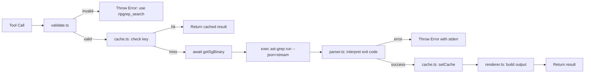

# @agentcastle/structural-analyzer

**Find code patterns, not text matches.** Uses ast-grep with Tree-sitter AST parsing to search for semantic constructs — function calls, class definitions, try/catch blocks, method invocations — without noise from comments or strings.

## Features

- **`structural_search` tool** — AST-aware code pattern search
  - S-expression and code-snippet pattern syntax
  - `$META_VAR` for single AST node matching (e.g., `console.log($A)`)
  - `$$$MULTI` for zero-or-more AST nodes (e.g., `try { $$$BODY } catch (e) { $A }`)
  - Structured JSON output: `{ matches, results: [{ file, lines, snippet }] }`
- **Pattern validation** — Rejects single-word text patterns that belong on ripgrep (collision rule)
- **Language auto-detect** — Language parameter is optional; auto-detects from project config files (tsconfig.json → typescript, pyproject.toml → python, go.mod → go, Cargo.toml → rust, sgconfig.yml → languageGlobs). Defaults to `ts`.
- **Result cache** — Results cached by (pattern, language, cwd). Repeated calls return instantly without re-executing ast-grep.
- **Streaming support** — Large result sets (>100 matches) return a truncated summary with total count. Refine the pattern to narrow results.
- **Snippet truncation** — Results capped at 120 characters per match
- **Custom TUI rendering** — In TUI mode, search results display with OSC 8 hyperlinked file paths and formatted line numbers for clickable navigation directly to matching lines
- **Mode-adaptive output** — LLM always receives structured JSON; human-readable formatting with hyperlinks appears only in the terminal (TUI) via `renderResult`
- **Prompt integration** — Injects `promptSnippet` and `promptGuidelines` so LLM knows when to use structural vs text search
- **Binary auto-detection** — Detects `ast-grep` vs `sg` binary name, cached across calls

## How it works

1. The LLM calls `structural_search` with a pattern (language is optional)
2. If language omitted, the extension auto-detects from project config files in scope (tsconfig.json → typescript, pyproject.toml → python, go.mod → go, Cargo.toml → rust, sgconfig.yml → languageGlobs). Defaults to `ts`.
3. The extension validates the pattern — rejects text-only patterns (redirects to `ripgrep_search`)
4. Checks the result cache — if the same (pattern, language, cwd) was searched before, returns cached result immediately
5. Runs `ast-grep run --pattern <pattern> --json=stream --lang <language>`
6. Parses NDJSON output into structured `SgMatch[]` results
7. If >100 matches, returns truncated summary with total count; otherwise returns full results
8. Caches the result for subsequent calls

## Install

```bash
pi install npm:@agentcastle/structural-analyzer
```

Then run `/reload` or restart pi.

## Usage

The LLM uses `structural_search` automatically. Language parameter is optional — when omitted, auto-detected from project files:

```
structural_search(pattern="console.log($A)")           # auto-detect language
structural_search(pattern="console.log($A)", language="ts")  # explicit language
structural_search(pattern="try { $$$BODY } catch (e) { $A }", language="js")
structural_search(pattern="function($A, $B)", language="go")
structural_search(pattern="class $A extends $B", language="py")
```

### Requirements

- Pi Coding Agent
- `ast-grep` installed globally: `npm i -g @ast-grep/cli`
- No npm dependencies — all peer deps are pi-provided

### Error handling

`structural_search` uses exit-code-based error detection. ast-grep conventions:

- **Exit code 0** — Success. Results parsed from JSONL output.
- **Exit code 1, empty stderr** — No matches found (legitimate, returns `matches: 0`).
- **Exit code 1, non-empty stderr** — ast-grep error (thrown so pi sets `isError: true` on the result).
- **Exit code ≥ 2** — Process error (permission denied, segfault, OOM kill, etc.). Always thrown as error.

Invalid patterns (single-word text patterns like `TODO`) are also thrown before execution — pi catches the error and reports it to the LLM with the error flag set.

This replaces the old keyword-heuristic approach that only caught stderr messages containing "unknown", "error", or "not found". Errors are signaled via `throw` rather than `return { isError: true }` to match pi's framework contract — only `throw` sets the `isError` flag on tool results.

### When to use structural_search vs ripgrep_search

| Use case                                       | Tool                |
| ---------------------------------------------- | ------------------- |
| "Where is verify_token called with what args?" | `structural_search` |
| "Find all TODO comments"                       | `ripgrep_search`    |
| "Show me every try/catch block"                | `structural_search` |
| "Search for error message 'timeout exceeded'"  | `ripgrep_search`    |

## Details

### Architecture

Modular design — 6 source files, 1 entry point, 5 pure-function modules:

```
├── index.ts     # Entry: tool registration, execute orchestration, event hooks
├── types.ts     # SgMatch, SgResult, ExecResultResponse interfaces
├── cache.ts     # FIFO-bounded Map cache (200 entries), keyed by pattern+language+cwd
├── language.ts  # Auto-detect language from sgconfig.yml / tsconfig.json / pyproject.toml / go.mod / Cargo.toml
├── parser.ts    # NDJSON stream parser, exit-code-based error interpretation, 100-match streaming threshold
├── validate.ts  # Pattern validation: rejects single-word text patterns, requires structural syntax ($, {, (, [)
└── renderer.ts  # TUI renderer: OSC 8 hyperlinks, expanded/collapsed views, truncation notices
```

### Execution Flow



### Key Design Decisions

- **Binary detection via lazy promise** — `getSgBinary()` caches the `ast-grep --version` check as a module-level promise. All concurrent callers await the same promise. On failure, the promise resets so next caller retries (transient fault recovery).
- **FIFO eviction, not LRU** — Cache uses simple FIFO eviction at 200 entries. Hot-spot patterns may evict cold entries first. Revisit LRU when usage data exists.
- **Null-byte cache key separator** — `${pattern}\x00${language}\x00${cwd}` prevents collision when inputs contain `::`.
- **Exit-code-based error interpretation** (not keyword heuristics) — code 0 = success, code 1 + empty stderr = no matches, all other non-zero = real errors. Stderr presence overrides success interpretation.
- **Streaming threshold at 100 matches** — results beyond 100 are truncated with a clear notice and `totalMatches` count. Refine pattern to narrow.
- **Language auto-detection** — checks 5 config files in priority: `sgconfig.yml` > `tsconfig.json` > `pyproject.toml` > `go.mod` > `Cargo.toml`. For `sgconfig.yml`, uses a naive line-based `languageGlobs:` parser (not a full YAML parser).
- **Naive YAML parser limitations** — Only extracts first key under `languageGlobs:`. Does not handle folded scalars (`>`), literal blocks (`|`), anchors, aliases, or complex keys. Acceptable because project `sgconfig.yml` files never use complex values.

### Renderer Adaptation

The TUI renderer (`renderer.ts`) shows:
- Summary: "Structural search: N matches"
- Each match: hyperlinked file path (OSC 8 `file://`), line range, truncated snippet
- Collapsed view: 5 matches default; expanded view: 20 matches
- Truncation notice when total exceeds displayed count
- Non-TUI modes: raw text pass-through without ANSI/OSC8 sequences

## License

MIT
