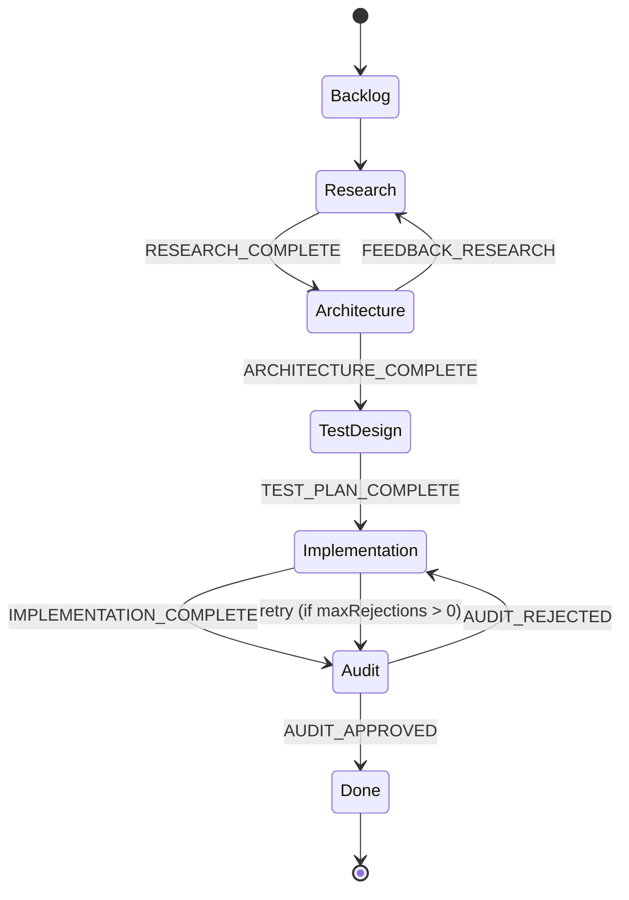
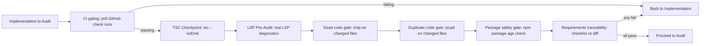

# Supervisor

**Autonomous Kanban pipeline for multi-agent development.** Drives a 5-agent sequence (Researcher → Architect → TestDesigner → Developer → Auditor) through GitHub Project board status transitions — all automated, all inside git worktrees.

## Why

Manual handoffs between research, architecture, implementation, and review are slow and inconsistent. The Supervisor automates the entire development lifecycle:

- **Reads GitHub issues** — Fetches issue details, comments, labels from your project board
- **Dispatches sub-agents** — Each agent gets its own system prompt, tool set, and model
- **Manages worktrees** — Creates isolated git worktrees for each pipeline run, preventing cross-contamination
- **Quality gates** — Runs TSC type-checking and LSP diagnostics before audit
- **GitHub project sync** — Moves board cards through status columns automatically
- **PR creation** — Creates pull requests with structured audit reports
- **Loop control** — Max rejection count prevents infinite loops (default: 5)
- **Token budgets** — Per-agent soft cap (default: 300K tokens)
- **Tool call limits** — Per-agent hard cap (default: 0 = unlimited)

## How it works

1. **Trigger** — User runs `/supervisor <issue-number>` in Pi TUI
2. **Config load** — Reads `.pi/settings.json` for repo, project number, status mapping, codeowners
3. **Fetch issue** — Fetches GitHub issue #42, filters to trusted codeowners
4. **Worktree creation** — Creates a git worktree at `.worktrees/feature-42/`
5. **Agent dispatch** — For each board status (Research → Architecture → TestDesign → Implementation → Audit):
   - Reads agent definition from `.pi/extensions/supervisor/agents/<agent>.md` (YAML frontmatter)
   - Loads the agent's tool set, skills, system prompt
   - Runs agent in its worktree via worktree-sandbox (isolated file operations)
   - Posts results as GitHub issue comments
   - Moves board card to next status
6. **Quality gates** — After Implementation, runs `tsc --noEmit` + LSP diagnostics on modified files. Failures return to Implementation (max 3 retries)
7. **Audit** — Auditor reviews diff, approves or rejects. Rejected issues cycle back to Implementation (counts as 1 rejection toward `maxRejections`)
8. **PR creation** — On approval, creates a PR with auditor's report as the body
9. **Post-pipeline** — Checks PR for merge conflicts, asks user to auto-fix if needed

### Agent definitions

Each agent is a Markdown file with YAML frontmatter defining:

```yaml
---
name: Developer
tools:
  - read
  - bash
  - write
  - edit
  - structural_search
  - ripgrep_search
skills:
  - extension-spec
model: opencode-go/deepseek-v4-flash
system_prompt: |
  You are the Developer agent. ...
---
```

### Configuration (`.pi/settings.json`)

```json
{
  "supervisor": {
    "repo": "SchneiderDaniel/cheasee-pi",
    "projectNumber": 3,
    "codeowners": ["SchneiderDaniel"],
    "statusMapping": {
      "Research": "researcher",
      "Architecture": "architect",
      "TestDesign": "test-designer",
      "Implementation": "developer",
      "Audit": "auditor"
    },
    "statusField": "Status",
    "maxRejections": 5,
    "agentTokenBudget": 300000,
    "maxToolCalls": 0,
    "bellOnComplete": false
  }
}
```

## Install

Part of Cheasee-Pi monorepo. Activated automatically.

## Requirements

- Pi Coding Agent ≥ 0.79.1
- GitHub CLI (`gh`) authenticated
- GitHub Project (v2) with matching status columns
- `.pi/settings.json` with supervisor configuration

## Details

### Architecture

Large extension (50+ source files) organized into workstreams:

```
├── index.ts        # Entry: command registration, pipeline lifecycle
├── pipeline/       # Pipeline orchestration: status resolution, agent dispatch, gates
├── agents/         # Agent definitions (MD files with YAML frontmatter)
├── config/         # Workflow config, stage transitions, settings loading
├── event/          # Event handlers for pipeline lifecycle
├── github/         # GitHub API: issues, PRs, comments, project board, check runs
├── session/        # Session management, worktree lifecycle
├── subagent/       # Sub-agent dispatch, structured output parsing
├── checks/         # Quality gates: CI, TSC, LSP, dead-code, duplicate-code, traceability
├── lib/            # Shared utilities
├── ignore/         # Temp worktree artifacts
└── test/           # Pipeline integration tests
```

### Pipeline State Machine



### Quality Gate Pipeline (pre-Audit)



### Key Design Decisions

- **Research dedup gate** — If `## Research Findings` already exists in issue comments/body, researcher is skipped entirely.
- **Structured JSON agent output** — `{ action, findings, commentBody, targetStatus }` with fallback to section heading detection, then legacy text markers.
- **Gate failure != Auditor rejection** — Gate failures (CI/TSC/LSP/knip/jscpd/traceability) send back to Implementation but do NOT count toward `maxRejections`. Context accumulated in `gateFailureHistory`.
- **Audit scoring across 8 dimensions** — Correctness, completeness, security, performance, style, test coverage, documentation, edge cases. Score must meet `auditScoreThreshold` (default 0.75).
- **Worktree isolation** — Each issue gets its own git worktree at `../<branch-prefix><issue-number>/`.
- **Per-agent budgets** — `agentTokenBudget` (soft cap) and `maxToolCalls` (hard cap).
- **Push recovery** — If branch SHA not found on remote (force push), pipeline recovers by fetching latest.

### Agent Definitions (YAML Frontmatter)

Each agent at `.pi/extensions/supervisor/agents/<agent>.md`:

```yaml
---
tools: [read, bash, structural_search, ripgrep_search]
extensions: [agent-harness, caveman, piignore, ...]
skills: [extension-spec]
model: opencode-go/deepseek-v4-flash
thinking: high
entryMarker: Architecture
outputFormat: structured-json
---
```

## License

MIT
