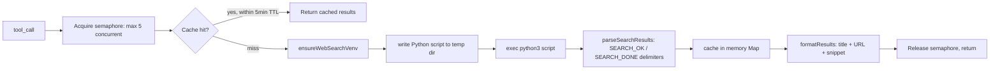

# @agentcastle/web-search

**Web search tool for Pi — DuckDuckGo search with ranked results.** Returns structured results with titles, URLs, and snippets for use by researcher and other agents.

## Features

- **`web_search` tool** — Search the web using DuckDuckGo metasearch engine
  - Accepts query string and optional `maxResults` (default 10, max 50)
  - Returns ranked `[{title, url, snippet}]` results
  - Uses `ddgs` Python library with `backend="auto"` for multi-engine fallback
  - Optional proxy support for restricted environments
  - Includes `promptGuidelines` for LLM context, guiding discovery of URLs before crawling with `web_crawl`
- **Delimiter-based output** — `SEARCH_OK` / `SEARCH_DONE` markers around JSON output for reliable parsing
- **Result cache** — Same query+maxResults returns cached result within 5-minute TTL
- **Error signaling via throw** — Errors (empty query, venv setup failure, search execution failure, parse failure) propagate as thrown exceptions per the extension framework contract, ensuring the LLM receives proper `isError` signaling
- **SIGTERM handling** — Python subprocess exits cleanly with code 130 on cancellation
- **Concurrency-safe isolation** — Each `web_search` call uses `fs.mkdtempSync` to create a unique temp directory, eliminating file races under concurrent calls

## How it works

1. The LLM calls `web_search` with a query and optional maxResults
2. The extension validates the query (rejects empty queries via thrown error)
3. **Cache check** — If the same query+maxResults was already searched within 5 minutes, the cached result is returned without re-running the subprocess
4. The extension writes the Python script and config to a per-call isolated temp directory (`ignore/web-search/search-<random>/`), preventing cross-contamination between concurrent searches
5. The script is executed via `bash -c` using `pi.exec`
6. The Python script uses `ddgs.DDGS().text(query, max_results=N, backend="auto")` to perform the search
7. Results are parsed from the `SEARCH_OK`/`SEARCH_DONE` delimited output
8. Results are cached in memory for the session duration (5-minute TTL)
9. A formatted result string is returned showing ranked results with titles as markdown links and snippets
10. On failure at any step (venv setup, search execution, result parsing), a thrown error propagates to the framework, which records the failure with `isError: true` on the tool execution event

## Install

No manual install needed. The extension auto-creates a Python virtual environment at `.pi/web-search-venv/` and installs `ddgs` from `requirements.txt` on first use.

Requirements:
- `python3` on system PATH
- Internet access (pip install on first `web_search` call)

## Usage

The LLM uses `web_search` automatically when researching topics. Example invocations:

```
web_search(query="latest rust web framework 2026", maxResults=5)
web_search(query="typescript best practices error handling")
web_search(query="python async patterns")
```

The tool is designed to work alongside `web_crawl` — use `web_search` to discover relevant URLs, then `web_crawl` to fetch full page content.

## Requirements

- Python 3.x
- `ddgs` Python package (`pip install ddgs`)
- Pi Coding Agent

## Details

### Architecture

```
├── index.ts         # Entry: tool registration, cache, concurrency semaphore
├── python-script.ts # Inline Python script (ddgs) as string constant
├── executor.ts      # runSearchScript: write temp file, exec subprocess, parse delimited output
├── venv-setup.ts    # Auto-create .pi/web-search-venv + pip install ddgs
├── types.ts         # SearchCacheEntry, SearchResult types
└── test/            # Executor + parser tests
```

### Execution Flow



### Key Design Decisions

- **Per-call isolated temp directory** — Each search writes to `ignore/web-search/search-<random>/`. Prevents file races under concurrent calls.
- **Concurrency semaphore** — Max 5 simultaneous searches. Prevents overwhelming DDGS API.
- **Cache TTL: 5 minutes** — In-memory with timestamp-aware expiry. Stale entries pruned on each set.
- **Python subprocess via `ddgs`** — Minimal library, no browser dependency. Venv auto-created on first call.
- **Delimiter-based parsing** — `SEARCH_OK` / `SEARCH_DONE` markers for reliable output extraction.
- **URL encoding for markdown** — Parentheses `()` encoded to prevent markdown link breakage.
- **SIGTERM handling** — Python subprocess exits cleanly with code 130 on cancellation.
- **Max results bounded** — `Math.min(Math.max(1, maxResults), 50)`.

## License

MIT
