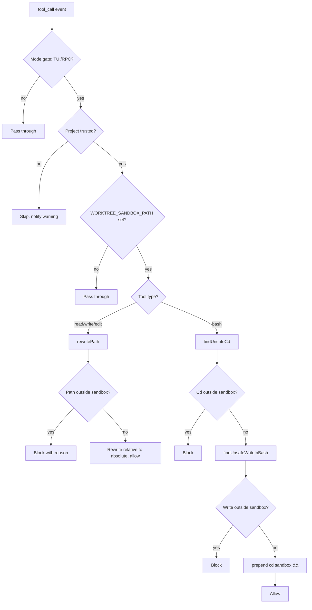

# Worktree Sandbox

**Keep agents inside their assigned worktree — no escape possible.** Intercepts `read`, `write`, `edit`, and `bash` tool calls, rewrites paths to target the worktree root, and blocks any operation that tries to escape.

## Why

When the Supervisor runs Developer and Auditor agents in parallel worktrees, each agent must only touch its own files. Without sandbox enforcement, an agent could:

- Read or modify files from another agent's worktree (race condition + data corruption)
- Write to the main checkout (breaks the isolation that worktrees provide)
- Use `cd` with shell expansion to escape (`cd $HOME`, `cd ~/escape`)
- Write files via shell redirects (`echo > /etc/passwd`)

Worktree Sandbox enforces this at the tool call boundary — **deterministic enforcement**, not prompt-level. The LLM cannot bypass it because tool input mutation happens before execution.

## How it works

1. **Activation** — Set `WORKTREE_SANDBOX_PATH` environment variable to the worktree root directory. When unset, all handlers pass through (no-op mode)
2. **Tool interception** — Hooks into `tool_call` event and processes every call:
   - **`read`/`write`/`edit`** — Relative paths get the worktree root prepended. Absolute paths are checked — blocked if outside worktree
   - **`bash`** — Prepends `cd "<worktree>" && ` to every command. Shell-aware parsing prevents `cd` escape via variables (`$HOME`), tilde expansion (`~/escape`), command substitution (`$(...)`), and pipe prefix bypasses (`echo | cd /escape`)
3. **Trust gate** — Before resolving `WORKTREE_SANDBOX_PATH`, checks `ctx.isProjectTrusted()`. Untrusted projects skip sandbox entirely — prevents attacker-controlled env var from redirecting sandbox to malicious paths
4. **Shell-aware parsing** — Uses `shell-quote` library to correctly tokenize bash commands, detecting:
   - `cd` targets with shell expansion (`$VAR`, `~`, `$(cmd)`)
   - Redirect targets (`>`, `>>`, `2>`) outside worktree
   - `cp`/`mv`/`install` destinations and `tee`/`touch` operands outside worktree
5. **Block notifications** — Blocked operations show a toast notification in TUI: `[sandbox] Blocked cd to outside worktree: $HOME`

### Guard flow

```
tool_call(event)
    │
    ├─ Mode check ── skip in print/JSON modes
    │
    ├─ Trust check ── skip if untrusted
    │
    ├─ WORKTREE_SANDBOX_PATH set? ── No → pass through (no-op)
    │
    ├─ read/write/edit:
    │     ├─ Relative path → prepend worktree root
    │     └─ Absolute path → block if outside worktree
    │
    └─ bash:
          ├─ Block cd escape (shell-aware parsing)
          ├─ Block file writes outside worktree (redirect/cp/mv/touch/tee/install)
          └─ Prepend `cd <worktree> && ` to every command
```

### Bypass prevention

| Bypass vector | How it's caught |
|--------------|-----------------|
| `cd $HOME` | Variable expansion → `""` → blocked as `<HOME>` |
| `cd ~/escape` | Tilde expansion → `hasShellExpansion()` |
| `cd $(echo /escape)` | Command substitution → `hasShellExpansion()` |
| `echo \| cd /escape` | Pipe prefix → `isCommandStart()` passes cd |
| `cd; cd /etc` | Bare cd → blocked as `<HOME>` | 
| `cat > /outside/file` | Redirect target → `findUnsafeWriteInBash()` |
| `cp file /outside/dest` | Last arg → `findUnsafeWriteInBash()` |
| `echo x \| tee /outside/f safe.txt` | **Every** `tee` operand checked (multi-destination), not just the last |
| `touch /outside/f safe.txt` | **Every** `touch` operand checked (multi-destination) |
| `cp -t /outside src` | `-t`/`--target-directory` value → `findUnsafeWriteInBash()` |

## Install

Part of Cheasee-Pi monorepo. Activated automatically.

## Requirements

- Pi Coding Agent ≥ 0.79.1 (for `isProjectTrusted`)
- `WORKTREE_SANDBOX_PATH` env var set (done by Supervisor when creating worktrees)
- `shell-quote` npm package (dependency)

## Details

### Architecture

Single-file extension with shell-aware path analysis:

```
├── index.ts        # Entry: tool_call handler, path rewrite, shell-aware escape detection + inlined token helpers
└── test/           # Unit tests for all enforcement paths
```

### Enforcement Strategy



### Bypass Vectors Blocked

| Vector | Example | Detection |
|--------|---------|-----------|
| Variable expansion | `cd $HOME/escape` | `hasShellExpansion()` |
| Command substitution | `cd \`escape\`` | `hasShellExpansion()` |
| Tilde expansion | `cd ~/../escape` | `hasShellExpansion()` |
| Pipe prefix | `echo \| cd /escape` | `isCommandStart()` |
| Bare cd | `cd && ./escape` | `findMeaningfulToken()` exhausted |
| Redirect escape | `cmd > /escape` | Redirect detection |
| cp/mv destination | `cp x /outside/file` | Command detection |
| tee/touch operands | `echo x \| tee /outside/f ok.txt` | Write-grammar table (`operands: "all"`) |
| target-directory option | `cp -t /outside src` | `targetDirectoryOptions` in grammar table |
| bundled target-directory | `cp -at /outside src` | Short-option bundles walked letter-by-letter (`-at` = `-a` + `-t`) |
| glob write operand | `echo x \| tee /outside/* ok.txt` | Glob token pattern is a target, not a skipped operator → `hasShellExpansion()` |
| glob target-directory | `cp -t /outside/* src` | Glob value extracted and checked, not dropped |
| glob value option | `touch -r /outside/* ok.txt` | Glob/expansion option values checked — extra expanded words become operands (arity guard) |
| Attached expansion on a flag | `cp -t$OUT src`, `touch -r$REF ok.txt` | Expansion-preserving tokenization keeps the `$` on the token instead of letting shell-quote drop it |
| Command word built by expansion | `c$X -t /outside src` | Expansion in command position fails closed — no grammar can be matched |
| Empty variable | `$UNSET_VAR` | Resolves to empty string, blocked |
| `cd -` | `cd -` | Previous dir always potentially unsafe |

### Key Design Decisions

- **Deterministic enforcement** — Mutates tool input before execution. LLM cannot bypass because input mutation runs before execution.
- **Trust gate before sandbox root resolution** — Prevents untrusted project from controlling `WORKTREE_SANDBOX_PATH`.
- **`cd` prepend** — All bash commands get `cd "<worktree>" && ` prepended. Ensures working directory is always the worktree.
- **Glob detection** — Tokens with `*`, `?`, `[` marked as unsafe because they could match outside files after shell expansion.
- **Mode gate** — Only enforces in TUI/RPC modes. Print/JSON skips to avoid filesystem overhead.
- **`--` option separator handled** — `cd -- /path` correctly detects target after `--`.

### Path Rewriting Rules

| Input | Type | Result |
|-------|------|--------|
| `relative/path.ts` | relative | Rewritten to `<sandbox>/relative/path.ts` |
| `/absolute/within/sandbox` | absolute (within) | Pass through, normalized |
| `/absolute/outside` | absolute (outside) | Blocked |
| `../../outside` | traversal | Blocked |
| `<sandbox>/../../../../etc/passwd` | absolute traversal | Blocked (resolved before check) |
| Directory for `read` | any | Blocked, suggest `bash ls` |

### Threat Model

The sandbox is a **best-effort interceptor**, not a process-level boundary. Absolute
defense requires OS-level isolation (container, seccomp, mount namespaces).

- **Lexical containment** — All paths are normalized with `node:path.resolve`
  (collapsing `..`, `//`, trailing slashes) *before* the containment check, and
the normalized path is what reaches the tool. This defeats `..` traversal
deterministically (CWE-22), matching the same fix shape as Vite CVE-2023-34092
(containment check must run on normalized input).
- **Symlink-escape residual** — `path.resolve` is lexical: it never resolves
  symlinks. A symlink inside the worktree pointing outside defeats the check
  (node-tar CVE-2021-32803 class). Realpath-based physical containment is
  deliberately not applied here to keep the token-scanning detectors I/O-free;
  the trust gate (untrusted projects skip sandbox entirely) mitigates the
  practical exposure. If physical containment is ever required, apply
  `fs.realpathSync` to the deepest existing ancestor and re-check containment.
- **TOCTOU** — The interceptor's `statSync` check and the tool's later open are
  separate syscalls (CWE-367). A concurrent attacker could swap a path between
  check and use. The resolve-first fix closes the deterministic escape; the
  remaining window is best-effort only.
- **Argv-shape denylist is empirically fragile** — The write detector is a
  declarative per-command grammar table (`WRITE_COMMAND_GRAMMARS` in
  `unsafe-write.ts`): `operands: "all"` for `tee`/`touch`, `operands: "last"`
  plus `-t`/`--target-directory` for `cp`/`mv`/`install`. Commands not in the
  table (`sed -i`, `tar -C`, `truncate -s`, `sponge`, `exec 3>file`, …) remain
  unmodelled, and GuardFall/ShellSieve measured 69–99% of real-world command
  denylists as bypassable via alternative argv shapes. Treat this as lexical
  interception, not a process boundary.
- **Expansion provenance is preserved before scanning** — shell-quote resolves
  an unresolved variable to `""` and silently drops the `$` when it is attached
  to a word (`cp -t$OUT src` → `["cp", "-t", "src"]`), which would hand the
  detector an option value that never existed. The write detector tokenizes
  with `tokenizeCommandPreservingExpansions` so the reference stays visible and
  the command fails closed; a variable the shell — not the detector — resolves
  is always treated as unsafe.

## License

MIT
