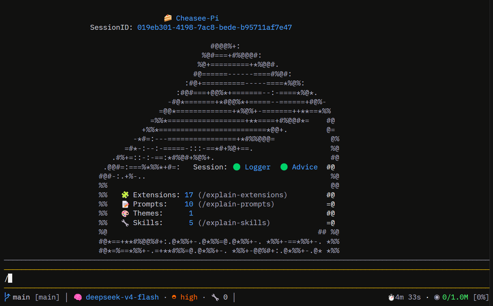

# Cheasee-Pi: Build Your Own PI. Cheap. Easy. Secure.

[](./LICENSE)
[](https://pi.dev)
[](./CONTRIBUTING.md)

**Token-saving agent harness with security guardrails and a Kanban git-oriented sub-agent framework.** Docker + Pi AI — autonomous Kanban pipeline, sandboxed execution, real-time feedback via git worktrees for parallel development.



## What is Cheasee-Pi?

Cheasee-Pi is a **Pi agent harness** built on the [Pi coding agent](https://pi.dev) — engineered to save tokens, enforce security boundaries, and drive sub-agents through a Kanban git-oriented workflow. It uses a GitHub Project board to orchestrate an autonomous multi-agent pipeline — Researcher → Architect → TestDesigner → Developer → Auditor — with tools that minimise token waste, enforce security boundaries, and streamline development inside isolated git worktrees.

All components run locally. No code leaves your machine (except LLM API calls to your provider).

## Extensions overview

| Extension | Purpose |
|-----------|---------|
| **Structural Analyzer** | AST-aware code search via ast-grep |
| **Ripgrep Search** | Fast literal/regex code search |
| **Supervisor** | Kanban-driven multi-agent pipeline |
| **Web Crawler** | Web crawling with Scrapling + Cloudflare bypass |
| **Web Search** | DuckDuckGo search via ddgs Python lib |
| **Context Info** | Rich TUI status bar (branch, model, tokens, TPS, cache) |
| **Session Logger** | Session logging to JSONL with Markdown reports |
| **Session Advice** | Post-session pattern analysis + feedback loop |
| **Agent Harness** | Runtime tool call validation (blocks dangerous patterns) |
| **Caveman Protocol** | Token-efficient communication |
| **Ask User** | Interactive MC dialogs + CSV logging |
| **Format on Save** | Auto Prettier + ESLint after write/edit |
| **PiIgnore** | Path blocking via `.piignore` patterns |
| **TSC Checkpoint** | `/check` command: `tsc --noEmit` |
| **Check Extensions** | Extension compatibility audit |
| **Worktree Sandbox** | Worktree path enforcement |
| **LSP Auditor** | LSP diagnostics pre-audit for pipeline |

## Quick start

```bash
git clone git@github.com:SchneiderDaniel/cheasee-pi.git
cd cheasee-pi
./cheasee-pi.sh
```

## Documentation

Full documentation is at **[schneiderdaniel.github.io/cheasee-pi](https://schneiderdaniel.github.io/cheasee-pi/)**.

| Section | What's there |
|---------|-------------|
| [Installation](https://schneiderdaniel.github.io/cheasee-pi/installation) | Prerequisites, step-by-step setup, verification |
| [Architecture](https://schneiderdaniel.github.io/cheasee-pi/architecture) | System design, extensions vs MCP, git worktrees, pipeline |
| [Extensions](https://schneiderdaniel.github.io/cheasee-pi/extensions) | All 17 extensions, agent definitions, published packages |
| [Skills](https://schneiderdaniel.github.io/cheasee-pi/skills) | 5 reusable skill definitions |
| [Methodology](https://schneiderdaniel.github.io/cheasee-pi/methodology) | Kanban pipeline, security, token efficiency, daily use |
| [Prompts](https://schneiderdaniel.github.io/cheasee-pi/prompts) | 11 prompt templates |
| [SBOM](https://schneiderdaniel.github.io/cheasee-pi/sbom) | Software Bill of Materials |
| [Acknowledgements](https://schneiderdaniel.github.io/cheasee-pi/acknowledgements) | Credits and licenses |

## Philosophy

Everyone should build their own Pi. This repo is **my personal** Pi agent harness. Fork it as a starting point, but the real power comes from shaping it into **your own** — your preferred tools, your workflows, your guardrails.

Customize ruthlessly. Make it yours.

## License

MIT © 2025. See [LICENSE](./LICENSE).
