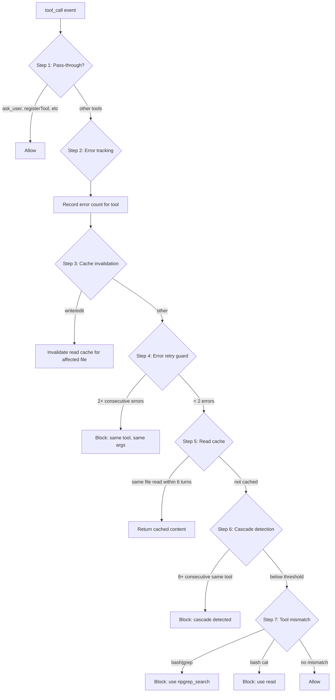

# Agent Harness

{: .no_toc }

[📄 README](../../.pi/extensions/agent-harness/README.md)

**Why.** Stops token waste before it executes. Every incorrect tool call costs tokens. Every error loop burns context window. Agent Harness intercepts tool calls and blocks wasteful patterns: `bash | grep` redirects to `ripgrep_search`, error retries blocked after 2 consecutive failures, same-tool cascades blocked after 8+ consecutive calls, redundant reads return cached results within 6 turns.

**How it works.** Hooks into pi's `tool_call` event and runs each call through a 7-step validation: pass-through check (ask_user etc.) → error tracking → cache invalidation on writes/edits → error retry guard (2+ errors) → read caching (6-turn TTL) → cascade detection (8+ consecutive) → tool mismatch blocks (bash|grep → ripgrep_search, bash cat → read). Configurable via `.pi/harness-config.json` with per-tool `cascadeThreshold` and `passThrough` flags. Caches reads across turns, re-read within TTL returns cached content without re-execution.

**Location:** `.pi/extensions/agent-harness/`

## Details

### Architecture

7-step validation pipeline on every tool call:

```
├── index.ts                  # Entry: session_start/tool_call/turn_start hooks, AgentHarness orchestration
├── agent-harness.ts          # AgentHarness class: handleToolCall with 7-step decision tree
├── lib/
│   ├── harness-rules.ts      # Rule definitions: cascade thresholds, pass-through tools, tool mismatches
│   ├── harness-state.ts      # HarnessState: error tracking, cascade counter, read cache, turn tracking
│   ├── load-config.ts        # Load harness config from .pi/harness-config.json
│   ├── timed-map.ts          # Generic timed map with TTL-based eviction
│   └── constants.ts          # Default thresholds, tool lists
├── test/                     # Extensive test suite
└── bash-query.ts (../../lib/) # Bash classification: isBashSearch, isBashFileRead, isBashFileModify
```

### Validation Pipeline



### Tool Mismatch Detection

The `bash-query.ts` module classifies bash commands via pure functions:

| Pattern | Detected By | Redirect To |
|---------|-------------|-------------|
| `bash | grep` | `getBashSubKey()` token analysis | `ripgrep_search` |
| `bash cat` | `getBashSubKey()` | `read` |
| `bash rg` | `getBashSubKey()` | `ripgrep_search` |
| `bash find . -name` | `getBashSubKey()` | `ripgrep_search` or `bash ls` |

### Key Design Decisions

- **Configurable per-tool thresholds** — `.pi/harness-config.json` allows per-tool `cascadeThreshold` (default 8) and `passThrough` flags. User can adjust for high-cascade workflows.
- **Read caching with 6-turn TTL** — `TimedMap` stores file contents for 6 turns after initial read. Subsequent reads within TTL return cached content without re-execution. Cache invalidated on write/edit to the same file.
- **Error retry guard caps at 2** — First retry is reasonable (transient failure). Second retry is wasteful. Third+ consecutive same-tool same-args calls are blocked. Counter resets on turn_start.
- **Cascade detection resets on turn_start** — Cascade counter (8+ consecutive same tool) resets each turn. Prevents long-running multi-tool sequences from false positives.
- **Pass-through list** — `ask_user`, `ask_user_read`, registered tool registrations, and command handlers are exempt from all validation. Configurable via `passThrough` in harness config.
- **Fail-safe defaults** — On config load failure (missing file, parse error), harness continues with hardcoded defaults. Never blocks tool calls due to config errors.

### Config Format (.pi/harness-config.json)

```json
{
  "tools": {
    "read": { "cascadeThreshold": 6, "passThrough": false },
    "bash": { "cascadeThreshold": 4, "passThrough": false },
    "ask_user": { "passThrough": true }
  }
}
```

### HarnessState Internal

```typescript
class HarnessState {
  errorTracker: Map<string, number>;       // toolName → consecutive error count
  cascadeCounter: Map<string, number>;     // toolName → consecutive call count
  readCache: TimedMap<string, string>;     // filePath → contents (6 turn TTL)
  turnNumber: number;

  handleTurnStart(): void {
    this.turnNumber++;
    this.cascadeCounter.clear();
    // Errors NOT cleared — persists across turns for retry tracking
  }
}
```

### Testing

Extensive test suite covering:
- All 7 validation steps with pass/fail conditions
- Tool mismatch detection: 10+ bash command patterns
- Read cache: set, get, TTL expiry, invalidation on write/edit
- Error retry guard: 2+ consecutive errors, counter reset on turn
- Cascade detection: threshold breach, pass-through exemption, turn boundary reset
- Config loading: missing file, invalid JSON, partial overrides
- TimedMap: get/set/has/delete, TTL-based eviction, key iteration
