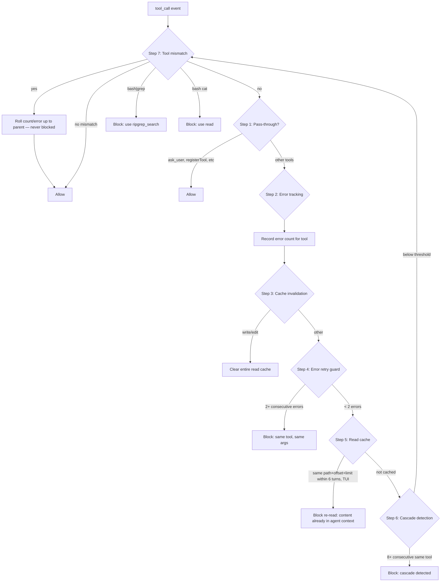

# Agent Harness

{: .no_toc }

[📄 README](../../.pi/extensions/agent-harness/README.md)

**Why.** Stops token waste before it executes. Every incorrect tool call costs tokens. Every error loop burns context window. Agent Harness intercepts tool calls and blocks wasteful patterns: `bash | grep` redirects to `ripgrep_search`, error retries blocked after 2 consecutive failures, same-tool cascades blocked after 8+ consecutive calls, redundant reads blocked with a hint within 6 turns (TUI).

**How it works.** Hooks into pi's `tool_call` event and runs each call through a validation pipeline: nested-call attribution (`parentToolCallId` → parent roll-up, never blocked) → pass-through check (ask_user etc.) → error tracking → cache invalidation on writes/edits → error retry guard (2+ errors) → read caching (6-turn TTL) → cascade detection (8+ consecutive) → tool mismatch blocks (bash|grep → ripgrep_search, bash cat → read; a write-redirect on grep/rg, e.g. `grep foo > out.txt`, passes through because `ripgrep_search` cannot write output files). Configurable via `.pi/harness-config.json` with per-tool `cascadeThreshold` and `passThrough` flags, plus annotation-derived defaults from `pi.getAllTools()` (explicit config wins). Caches reads across turns as an existence marker; a re-read of the same path+offset+limit within the dual TTL (6 turns / 30 s) is blocked with a hint in TUI mode (non-TUI passes through) — it does not return cached bytes.

**Location:** `.pi/extensions/agent-harness/`

## Details

### Architecture

Validation pipeline on every tool call (step 0.5 = nested attribution):

```
├── index.ts                  # Entry: session_start/tool_call/turn_start hooks, AgentHarness orchestration, pi.getAllTools() port
├── agent-harness.ts          # AgentHarness class: handleToolCall with decision tree (nested attribution + force-bypass first)
├── lib/
│   ├── harness-rules.ts      # Rule definitions: cascade thresholds, pass-through tools, tool mismatches
│   ├── tool-annotations.ts   # Pure MCP-annotation → ToolMeta mapping (readOnly/destructive/openWorld)
│   ├── harness-state.ts      # HarnessState: error tracking, cascade counter, read cache, call-id index, turn tracking
│   ├── load-config.ts        # Load harness config from .pi/harness-config.json
│   ├── timed-map.ts          # Generic timed map with TTL-based eviction
│   └── constants.ts          # Default thresholds, tool lists
├── test/                     # Extensive test suite
└── bash-query.ts (../../lib/) # Bash classification: isBashSearch, isBashFileRead, isBashFileModify
```

### Validation Pipeline


```mermaid
flowchart TD
    A[tool_call event] --> N{Step 0.5: Nested call?
parentToolCallId set}
    N -- yes --> N2[Roll count/error up to parent — never blocked]
    N2 --> Q
    N -- no --> B{Step 1: Pass-through?}
    B -- ask_user, registerTool, etc --> C[Allow]
    B -- other tools --> D{Step 2: Error tracking}
    D --> E[Record error count for tool]
    E --> F{Step 3: Cache invalidation}
    F -- write/edit --> G[Clear entire read cache]
    F -- other --> H{Step 4: Error retry guard}
    H -- 2+ consecutive errors --> I[Block: same tool, same args]
    H -- < 2 errors --> J{Step 5: Read cache}
    J -- same path+offset+limit within 6 turns, TUI --> K[Block re-read: content already in agent context]
    J -- not cached --> L{Step 6: Cascade detection}
    L -- 8+ consecutive same tool --> M[Block: cascade detected]
    L -- below threshold --> N{Step 7: Tool mismatch}
    N -- bash|grep --> O[Block: use ripgrep_search]
    N -- bash cat --> P[Block: use read]
    N -- no mismatch --> Q[Allow]
```

### Tool Mismatch Detection

The `bash-query.ts` module classifies bash commands via pure functions:

| Pattern | Detected By | Redirect To |
|---------|-------------|-------------|
| `bash | grep` | `getBashSubKey()` token analysis | `ripgrep_search` |
| `bash cat` | `getBashSubKey()` | `read` |
| `bash rg` | `getBashSubKey()` | `ripgrep_search` |
| `bash find . -name` | `getBashSubKey()` | `ripgrep_search` or `bash ls` |

### Key Design Decisions

- **Annotation-derived defaults** — Each `tool_call` resolves a tool's default `ToolMeta` from its MCP `annotations` (via a lazy `pi.getAllTools()` port) when neither config nor hardcoded `TOOL_META` lists it: `readOnlyHint` tools skip error tracking, `destructiveHint` tightens the cascade threshold, `openWorldHint` loosens it. Missing hints are **never treated as safe** (`destructiveHint ?? true`, `openWorldHint ?? true`, read-only only on `readOnlyHint === true`). Annotations are advisory/unverified — explicit config always wins. Precedence: config `toolMeta` > hardcoded `TOOL_META` > annotation-derived > generic default. Resolved lazily per call (no session snapshot) and feature-detected: below Pi 0.99.0 (no `annotations`) the port yields nothing and legacy behavior applies.
- **Nested-call attribution** — `ctx.executeTool()`-issued calls share the `tool_call` handler and carry `parentToolCallId` with a pi-assigned `<parent>/<n>` id. The harness resolves the parent through a turn-bounded call-id index that stores each call's composite counter identity (tool + bash sub-key) rather than string-splitting the synthetic id (ambiguous at depth ≥2), and rolls nested counts/errors up under that exact identity so an interleaved same-tool parent with a different sub-key is not mis-attributed. A nested call's roll-up is deliberately kept separate from the model-issued active chain: it increments the parent's stored count — which stays visible to the parent's own cascade check — without re-anchoring that chain, so a late nested call can never rewind a sibling's in-flight chain. For depth ≥2 the call-id index propagates the root parent's identity, so a grandchild rolls up to the same parent rather than to a counter under the nested tool. Nested errors inherit the parent's effective `trackErrors`: a read-only parent is never error-blocked by nested failures, while explicit config `trackErrors: true` restores it. Nested calls are **never blocked** — a nested block breaks the parent tool rather than teaching the model; an unmapped parent id is ignored (and its descendants stay uncounted). Cache invalidation still runs for nested writes.
- **Configurable per-tool thresholds** — `.pi/harness-config.json` allows per-tool `cascadeThreshold` (default 8) and `passThrough` flags. Top-level `cascadeThreshold` is the global default; `toolMeta.<tool>.cascadeThreshold` is the per-tool override. User can adjust for high-cascade workflows.
- **Read caching with dual TTL (6 turns / 30 s)** — `TimedMap` stores an existence marker (`{ turn, timestamp }`) keyed by `path|offset|limit` for 6 turns or 30 s wall-clock. A hit returns no bytes: in TUI mode it blocks the re-read with a hint (content already in the agent's context); non-TUI passes through. Any `write`/`edit` or file-modifying `bash` clears the entire cache.
- **Error retry guard caps at 2** — First retry is reasonable (transient failure). Second retry is wasteful. Third+ consecutive same-tool same-args calls are blocked. Counter resets on turn_start.
- **Cascade detection resets on turn_start** — Cascade counter (8+ consecutive same tool) resets each turn. Prevents long-running multi-tool sequences from false positives.
- **Pass-through list** — `ask_user`, `ask_user_read`, registered tool registrations, and command handlers are exempt from all validation. Configurable via `passThrough` in harness config.
- **Fail-safe defaults** — On config load failure (missing file, parse error, unknown top-level key), harness warns the user (TUI `notify` / RPC `sendUserMessage` / `console.error`) and continues with hardcoded defaults. Never blocks tool calls due to config errors, and never discards the config silently.

### Config Format (.pi/harness-config.json)

Top-level `cascadeThreshold` is the global default; `toolMeta.<tool>.cascadeThreshold` overrides it per tool.

```json
{
  "toolMeta": {
    "read": { "cascadeThreshold": 6, "passThrough": false },
    "bash": { "cascadeThreshold": 4, "passThrough": false },
    "ask_user": { "passThrough": true }
  },
  "cascadeThreshold": 8
}
```

Allowed top-level keys are `toolMeta` and `cascadeThreshold`. Any other key is rejected: the config is discarded, the harness warns (`Unknown key in .pi/harness-config.json: "...". Allowed keys: ...`), and default rules apply.

### HarnessState Internal

```typescript
class HarnessState {
  errorTracker: Map<string, number>;       // toolName → consecutive error count
  cascadeCounter: Map<string, number>;     // toolName → consecutive call count
  readCache: TimedMap<string, ReadCacheEntry>; // (path|offset|limit) → { turn, timestamp } marker (6 turn / 30 s TTL)
  turnNumber: number;

  handleTurnStart(): void {
    this.turnNumber++;
    this.cascadeCounter.clear();
    // Errors NOT cleared — persists across turns for retry tracking
  }
}
```

### Testing

Extensive test suite covering:
- All 7 validation steps with pass/fail conditions
- Tool mismatch detection: 10+ bash command patterns
- Read cache: set, get, TTL expiry, invalidation on write/edit
- Error retry guard: 2+ consecutive errors, counter reset on turn
- Cascade detection: threshold breach, pass-through exemption, turn boundary reset
- Config loading: missing file, invalid JSON, partial overrides
- TimedMap: get/set/has/delete, TTL-based eviction, key iteration
