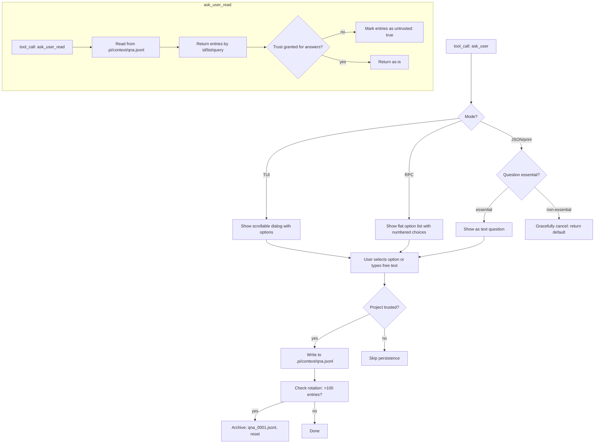

# Ask User

{: .no_toc }

[📄 README](../../.pi/extensions/ask-user/README.md) — [`@cheasee-pi/ask-user` on npm](https://www.npmjs.com/package/@cheasee-pi/ask-user)

**Why.** The LLM needs decisions, preferences, or clarifications — instead of hallucinating defaults, it calls `ask_user` and you respond through a structured dialog. Supports multiple-choice (with recommendation marker) and free-text modes.

**How it works.** Two tools registered: `ask_user` (choice/freetext modes with mode-adaptive UI: TUI gets scrollable dialog, RPC gets flat option list, JSON/print gracefully cancel non-essential questions) and `ask_user_read` (retrieve past Q&A entries by id, list, or text query — returns `untrusted: true` when trust not granted). All interactions saved to `.pi/context/qna.jsonl` with auto-rotation at 100 entries (archived as `qna_0001.jsonl`, etc.). Legacy `.pi/context/qna.csv` is auto-migrated to JSONL on first access. Trust-gated persistence — history only written when `ctx.isProjectTrusted()` is true. Includes `/qna` command for browsing history (gated behind project trust).

**Location:** `.pi/extensions/ask-user/`

## Details

### Architecture

Dual-tool extension with trust-gated persistence:

```
├── index.ts  # Entry: register ask_user and ask_user_read tools, Q&A lifecycle
└── test/     # Unit tests
```

Single-file extension. Core concerns:
- **`ask_user` tool** — Choice and freetext modes with mode-adaptive rendering
- **`ask_user_read` tool** — Retrieve past Q&A entries by id, list, or text query
- **Persistence manager** — JSONL-based Q&A log with auto-rotation at 100 entries
- **Trust gate** — History only written when `ctx.isProjectTrusted()` is true
- **Mode adaptation** — TUI gets scrollable dialog, RPC gets flat option list, JSON/print gracefully cancel non-essential questions

### Execution Flow



### Mode-Specific Rendering

| Mode | ask_user UI | ask_user_read UI |
|------|------------|------------------|
| **TUI** | Scrollable dialog with option buttons | Inline list with IDs |
| **RPC** | Flat numbered list (1. Option) | Structured JSON |
| **JSON** | Graceful cancel for non-essential; text for essential | Structured JSON |
| **Print** | Same as JSON | Same as JSON |

### Choice Mode Mechanics

- Options accept `label`, `value`, `recommended` fields
- Exactly one option must have `recommended: true`
- `disableOther: true` suppresses the automatic "Other" option (for quizzes/exams)
- At least 3 options required (Other appended automatically unless disabled)
- Recommendation shown with visual marker (star/checkmark in TUI, "(recommended)" in text)

### Freetext Mode

- No predefined options displayed
- User types free-form response
- Options array ignored entirely
- Used for open-ended questions (descriptions, opinions, freeform input)

### Persistence Details

```
.pi/context/
├── qna.jsonl          # Active Q&A log (max 100 entries)
├── qna_0001.jsonl     # Archived log (rotated)
├── qna_0002.jsonl     # Archived log (rotated)
└── ...                # More archives
```

- Auto-rotation at 100 entries per file
- Legacy `.pi/context/qna.csv` auto-migrated to JSONL on first access
- Each entry: `{ id, timestamp, question, answer, mode, trusted }`
- Trust is per-entry: `untrusted: true` when trust not granted
- `/qna` command for browsing history (gated behind project trust)

### Key Design Decisions

- **Graceful cancellation in JSON/print** — Non-essential questions ("Would you like to continue?") return a sensible default instead of blocking. Essential questions (required decisions) still display as text.
- **Recommendation marker** — Helps guide user toward the recommended choice without making it mandatory. User can still pick any option.
- **History trust model** — Answers stored only on trusted projects. Untrusted projects can still use ask_user (dialog works) but history is not persisted. This prevents leaking sensitive decisions into Q&A log on untrusted repos.
- **`ask_user_read` trust awareness** — Returns `untrusted: true` when trust not granted. Consumers can show/hide past entries based on trust status.
- **Auto-migration from CSV** — Legacy format detected on first access, automatically converted to JSONL, original CSV renamed to `.csv.migrated`. Zero-touch upgrade.

### Testing

Tests cover:
- Choice mode: option parsing, recommended marker, disableOther
- Freetext mode: no options, freeform input
- Mode adaptation: TUI/RPC/JSON/print rendering
- Persistence: write, read, rotation, archive
- Legacy migration: CSV → JSONL conversion
- Trust gate: trusted → write, untrusted → skip
- ask_user_read: list/get/query actions, untrusted marking
- Graceful cancellation: essential vs non-essential questions
