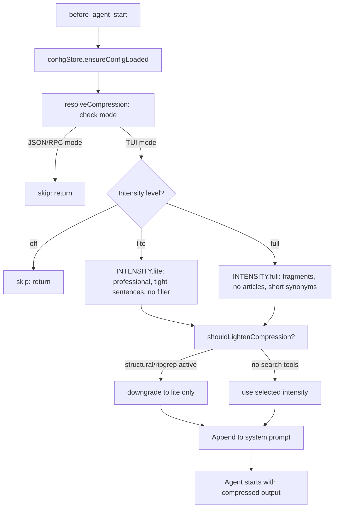

# Caveman Protocol

{: .no_toc }

[📄 README](https://github.com/SchneiderDaniel/cheasee-pi/blob/main/.pi/extensions/caveman/README.md)

**Why.** Reduces response token count 30-50% by dropping articles, filler words, pleasantries, and hedging from all agent output. Active every session via `AGENTS.md`. Saves thousands of tokens per session.

**How it works.** Reads config from `~/.pi/agent/caveman.json`, checks `AGENTS.md` for session level override. Three intensity levels: **lite** (professional, tight sentences, drops filler only), **full** (fragments, drops articles, short synonyms), **off** (no compression). Mode-adaptive — skips compression in JSON/RPC modes to avoid mangling structured output. Auto-lightens when `ripgrep_search`/`structural_search` are active (preserves tool output structure). Injects rules into system prompt via `before_agent_start`. Cycle with `/caveman` command. Auto-clarity: full caveman disables for security warnings, irreversible actions, or when user asks to clarify. Saves thousands of tokens per session.

### Intensity levels

- **Lite** — professional but tight. No filler/hedging. Full sentences. Active via `/caveman lite`.
- **Full** — fragments. Drops articles, pleasantries. Short synonyms. Active via `/caveman full`.
- **Off** — no compression. Active via `/caveman off`.

Sessions default to **Full** level configured in `AGENTS.md`.

**Location:** `.pi/extensions/caveman/`

## Details

### Architecture

Compression engine with intensity levels and mode awareness:

```
├── index.ts        # Entry: lifecycle hooks (session_start, agent_start, before_agent_start)
├── config.ts       # ConfigStore: load/save caveman.json, getConfig/setLevel
├── config-ui.ts    # Configuration UI for TUI mode
├── session.ts      # resolveSessionLevel: detect level from AGENTS.md, session entries
├── compression.ts  # resolveCompression: intensity selection, mode-aware skip logic
├── command.ts      # /caveman command handler: cycle through levels
├── prompts.ts      # CAVEMAN_BASE + INTENSITY prompt templates
├── types.ts        # Level, CavemanConfig interfaces
└── test/           # Unit tests for compression, config, lifecycle
```

### Compression Pipeline



### Prompt Injection

The extension injects these rules into the agent's system prompt via `before_agent_start`:

**BASE** (always injected when caveman is on):
```
## Caveman Mode — Active

IMPORTANT: You are in CAVEMAN MODE. Respond terse like smart caveman.
All technical substance stay. Only fluff die.
...
```

**Full intensity** adds:
```
Rules:
- Drop articles (a/an/the), filler (just/really/basically/actually/simply)
- Drop pleasantries (sure/certainly/of course/happy to), hedging
- Fragments OK. Short synonyms (big not extensive, fix not "implement a solution for")
- Technical terms exact. Code blocks unchanged. Errors quoted exact.
- Pattern: [thing] [action] [reason]. [next step].
...
```

### Key Design Decisions

- **Session level resolution** — `resolveSessionLevel()` checks in order: `AGENTS.md` for explicit session override → stored config level → `caveman.json` default → `"full"` as ultimate fallback.
- **Persistent config** — `~/.pi/agent/caveman.json` stores user preference. `AGENTS.md` overrides per session.
- **Mode awareness** — JSON/RPC modes skip compression entirely to avoid mangling structured output. Detected via `ctx.mode`.
- **Tool-aware lightening** — When `ripgrep_search`/`structural_search` are in `selectedTools`, `shouldLightenCompression()` returns `true` to preserve tool output structure integrity. Full → lite.
- **Auto-clarity triggers** — Full caveman disables for: security warnings, irreversible action confirmations, multi-step sequences where fragment order risks misread, compression-created technical ambiguity, or when user asks to clarify/repeat.
- **Status indicator** — TUI shows `caveman: FULL` / `caveman: LITE` / (hidden when off) in status bar via `ctx.ui.setStatus()`. Hidden in non-TUI modes.
- **Cycle with `/caveman`** — Toggles: off → full → lite → off. `/caveman off` explicitly to off, `/caveman lite` sets lite, `/caveman full` sets full.
- **Session level reset on shutdown** — `resetSessionLevel()` reverts to config default on session shutdown, preventing cross-session bleed.
- **Entry appending** — `caveman-level` entry appended to session when level differs from config default. Only on trusted projects.

### Intensity Level Characteristics

| Aspect | Lite | Full |
|--------|------|------|
| Articles | Kept | Dropped |
| Sentences | Full sentences | Fragments |
| Filler | Dropped | Dropped |
| Pleasantries | Dropped | Dropped |
| Hedging | Dropped | Dropped |
| Synonyms | Normal | Short (big, fix) |
| Code blocks | Unchanged | Unchanged |
| Error quotes | Exact | Exact |
| Security warnings | Normal | Auto-clarity |
| Irreversible actions | Normal | Auto-clarity |

### Testing

Tests cover:
- Compression: all 3 levels, mode skip (JSON/RPC)
- Config: load, save, default fallback
- Session: level resolution from AGENTS.md, entry append logic
- Command: cycle through levels, explicit set, error handling
- Lifecycle: session_start, agent_start, shutdown
- Auto-clarity: trigger conditions, intensity lightening
- Tool-aware lightening: search tools in selectedTools → lite only
- Status UI: show/hide in TUI mode, hidden in non-TUI
