# Context Info

{: .no_toc }

[📄 README](../../.pi/extensions/context-info/README.md)

**Why.** Replaces pi's default footer with a rich dashboard: git branch, model name, token usage with color thresholds, TPS during streaming, cache hit rate, session name, trust status, thinking level, live timer, and tool call counter.

**How it works.** Creates `FooterState` on session start, reads config from `.pi/settings.json` (top-level settings: `quietStartup`, `contextStatusBar.showTps`). Detects git worktree name, captures session name and trust status. Installs custom footer via `ctx.ui.setFooter()` (TUI only). Updates reactively on `model_select`, `thinking_level_select`, `turn_end`, `message_end` (token+cache stats), `message_update` (TPS sampling through deduplicated key extraction), `tool_execution_end`. Timer updates session duration display every second. Session_shutdown stops timer.

Registers three `/explain-*` commands for listing discovery:
- `/explain-extensions` — Lists all active extensions with descriptions
- `/explain-prompts` — Lists all available prompt templates
- `/explain-skills` — Lists all available skills

Also provides `setSupervisorIssueData` / `clearSupervisorIssueData` exported API for the supervisor pipeline to display current issue number/title/repo in the TUI footer.

**Location:** `.pi/extensions/context-info/`

## Details

### Architecture

Reactive footer system with event-driven updates and timer:

```
├── index.ts            # Entry: event hooks, state management, /explain-* commands
├── footer.ts           # installFooter: builds TUI footer component tree
├── footer-state.ts     # FooterState: mutable state container with render triggers
├── config.ts           # Load config from .pi/settings.json (quietStartup, contextStatusBar)
├── types.ts            # ThresholdEntry, TpsSample, FooterConfig interfaces
├── git-helpers.ts      # Worktree name detection from git rev-parse
├── telemetry.ts        # tryEmit: lightweight telemetry emission
├── extensions.ts       # List active extensions from .pi/extensions/
├── prompts.ts          # List available prompt templates
├── skills.ts           # List available skills
├── explain.ts          # createExplainCommand: /explain-* command factory with word-wrap
├── cheasee-pi-info.ts  # /cheasee-pi-info command with repo version display
└── test/               # Unit tests
```

### Footer State Machine

```mermaid
flowchart TD
    A[session_start] --> B[FooterState.resetProperties]
    B --> C[loadConfig]
    C --> D{config null?}
    D -- yes --> E[clear UI: setFooter undefined, setStatus undefined, stopTimer]
    D -- no --> F[set worktreeName, sessionName, trustStatus]
    F --> G[installFooter: build TUI component]
    G --> H[startTimer: 1s interval]
    
    H --> I{Event received}
    I -- model_select --> J[update model name, contextWindow, cacheHitRate]
    I -- thinking_level_select --> K[update thinkingLevel]
    I -- turn_end --> L[re-render footer]
    I -- message_end --> M[update token usage, cache stats]
    I -- message_update --> N[sample TPS]
    I -- tool_execution_end --> O[increment toolCallCount]
    I -- session_shutdown --> P[stopTimer, dispose]
```



### Footer Component Tree

The TUI footer renders a single-line status bar with adaptive segments:

```
[Git branch]  [Model name]  [Thinking level]  [⏱ timer]  [Tokens used/max]  [TPS]  [Cache hit rate]  [Session name]  [Trust status]  [Tool calls]
```

Each segment is implemented as a reactive `Widget` that updates when its backing `Reactive` value changes. The `FooterState` object holds all reactive values and calls `installFooter()` (mutating `FooterConfig`) which triggers `ctx.ui.setFooter()` re-render.

### Key Design Decisions

- **FooterState lifecycle** — Created on `session_start`, disposed on `session_shutdown`. Previous state is disposed before creating new one to prevent stale `ctx` closures after reload/newSession/fork/switchSession.
- **Working indicator** — Custom dot pulse (`·` → `•` → `●` → `•`) instead of standard spinner. Set in `session_start` for TUI mode.
- **TPS sampling** — On `message_update` event, samples streaming output tokens. Uses deduplicated key extraction to prevent double-counting. Sampled every ~200ms during streaming.
- **Cache hit rate** — Computed from `cacheRead / (cacheRead + cacheWrite)` on each `message_end`. Rounded to integer percentage. Reset on model change (provider/model-specific cache keys).
- **Quiet startup** — When `quietStartup: true` in config, startup hint and working indicator are suppressed.
- **Explain commands** — `/explain-extensions`, `/explain-prompts`, `/explain-skills` render inline lists. Widgets auto-cleared on first `input`/`before_agent_start`/`user_bash` event.
- **Supervisor integration** — Exported `setSupervisorIssueData`/`clearSupervisorIssueData` allow supervisor pipeline to display current issue number/title/repo in the TUI footer. Uses function reference (`stateRef`) set on session_start.
- **Timer** — `startTimer()` sets a `setInterval` at 1s. `stopTimer()` clears it. Timer updates `FooterConfig.timer` value and triggers re-render.

### Event → Footer Update Map

| Event | Fields Updated |
|-------|---------------|
| `session_start` | worktreeName, sessionName, trustStatus, sessionId, contextWindow |
| `model_select` | modelName, contextWindow, cacheHitRate, sessionName |
| `thinking_level_select` | thinkingLevel |
| `turn_end` | sessionName (re-read) |
| `message_end` | tokensUsed, tokensMax, cacheRead, cacheWrite, cacheHitRate |
| `message_update` | TPS samples |
| `tool_execution_end` | toolCallCount |
| `session_shutdown` | Timer stopped, state disposed |

### Testing

Tests cover:
- Footer state: all reactive values, mutations, reset
- Event handlers: each event → correct field update
- Timer: start/stop/interval behavior
- TPS sampling: deduplication, accumulation, average computation
- Explain commands: extension/prompt/skill listing, error handling
- Config loading: all settings paths, missing file, invalid JSON
- Supervisor integration: set/clear issue data functions
