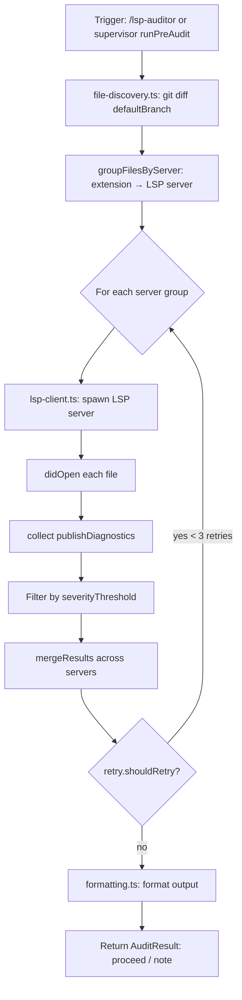

# LSP Auditor

{: .no_toc }

[📄 README](https://github.com/SchneiderDaniel/cheasee-pi/blob/main/.pi/extensions/lsp-auditor/README.md) — [`@cheasee-pi/lsp-auditor` on npm](https://www.npmjs.com/package/@cheasee-pi/lsp-auditor)

**Why.** Runs real Language Server Protocol diagnostics on changed files before code review — catches errors, warnings, and hints the LLM might miss. Called automatically by the supervisor pipeline during the Audit stage.

**How it works.** Triggered manually via `/lsp-auditor` or automatically by supervisor (`runPreAudit()`). Uses `git diff <defaultBranch> --name-only` to find changed files. Groups by file extension (`.ts` → `typescript-language-server`, `.py` → `pylsp`, `.rs` → `rust-analyzer`, `.go` → `gopls`). Spawns LSP servers per group, opens files via `didOpen`, collects `publishDiagnostics` notifications. Filters by per-server `severityThreshold` (error/warning/info). Retries up to 3 times with session-stored retry counters. Trust-gated — untrusted projects skip LSP audit (returns `{ proceed: true }` with warning, matching VS Code Restricted Mode precedent).

**Location:** `.pi/extensions/lsp-auditor/`

## Details

### Architecture

Multi-server LSP orchestrator with file discovery and retry logic:

```
├── index.ts              # Entry: command registration (/lsp-auditor), runPreAudit export
├── run-pre-audit.ts      # Orchestrator: discover files → group by server → audit each group
├── lsp-client.ts         # LSP client: spawn server, didOpen, collect publishDiagnostics
├── server-mappings.ts    # Extension → server mapping (.ts→typescript-language-server, .py→pylsp, etc.)
├── file-discovery.ts     # git diff file discovery + extension grouping
├── formatting.ts         # Diagnostic formatting, severity filtering, result merging
├── settings.ts           # Read .pi/settings.json for defaultBranch
├── retry.ts              # Retry logic: countRetryAttempts, shouldRetry, MAX_RETRIES=3
├── output-adapter.ts     # Mode-adaptive output formatting (TUI/RPC/JSON/print)
├── types.ts              # LspDiagnostic, ServerMapping, AuditResult interfaces
└── test/                 # Unit + integration tests
```

### Execution Flow



### Server Mappings

| Extension | LSP Server | Notes |
|-----------|-----------|-------|
| `.ts` | `typescript-language-server` | Full TS/TSX support |
| `.py` | `pylsp` | Python LSP |
| `.rs` | `rust-analyzer` | Rust LSP |
| `.go` | `gopls` | Go LSP |
| (others) | — | Skipped with warning |

### Key Design Decisions

- **File discovery via `git diff`** — Only checks modified files vs defaultBranch. Prevents checking entire codebase. `git diff <defaultBranch> --name-only`.
- **Per-server severity threshold** — Each server mapping configures `severityThreshold` (error/warning/info). Diagnostics below threshold are filtered out.
- **Retry with session-stored counters** — Retries up to 3 times per server group. Counter stored in session scope. `shouldRetry()` checks both attempt count and error type (transient vs permanent).
- **Trust gate** — Untrusted projects skip LSP audit entirely (returns `{ proceed: true }` with warning). Matches VS Code Restricted Mode precedent.
- **Mode-adaptive output** — TUI: notification + clickable markdown. RPC/JSON: structured `{ proceed, note, diagnostics }`. Print: plain text.
- **Passive by default** — No lifecycle hooks. Activated by supervisor's `runPreAudit()` or manual `/lsp-auditor` command. All public API re-exported for supervisor imports.
- **Spawn + didOpen protocol** — LSP servers are spawned on-demand, files opened via `didOpen`, diagnostics collected from `publishDiagnostics` notifications. No file watching needed.

### Retry Logic

```typescript
MAX_RETRIES = 3

function shouldRetry(attempts: number, error: Error): boolean {
  if (attempts >= MAX_RETRIES) return false;
  // Only retry on transient errors (connection refused, timeout, process crash)
  // Not on permanent errors (invalid file, missing server binary)
  return error.message.includes('ECONNREFUSED') ||
         error.message.includes('ETIMEDOUT') ||
         error.message.includes('process exited');
}
```

### Testing

Tests cover:
- File discovery: git diff parsing, empty diffs, binary file exclusion
- Server mappings: extension matching, unknown extension fallback
- LSP client: spawn, didOpen, diagnostic collection, timeout handling
- Retry logic: attempt counting, transient vs permanent error classification
- Formatting: severity filtering, result merging, markdown generation
- Output adapter: all 4 modes (TUI, RPC, JSON, print)
