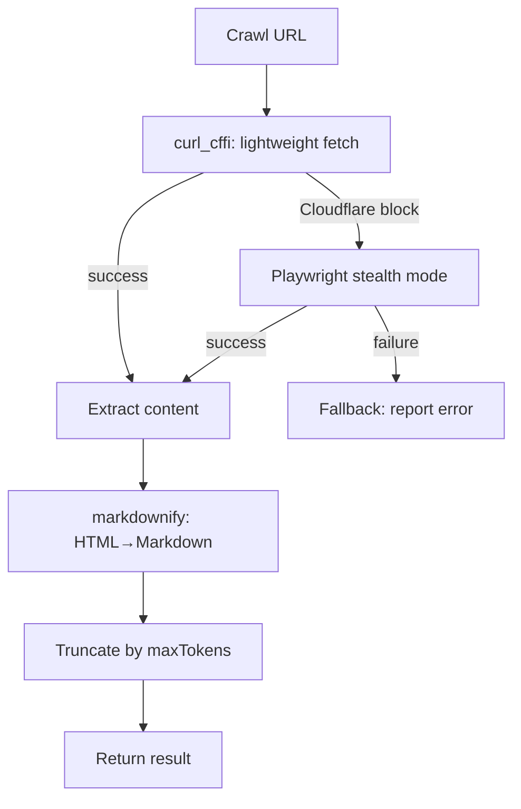

# Web Crawl (scrapling)

{: .no_toc }

[📄 README](https://github.com/SchneiderDaniel/cheasee-pi/blob/main/.pi/extensions/scrapling/README.md)

**Why.** Crawl web pages behind Cloudflare and extract content as Markdown. Progressive fetching — starts lightweight (`curl_cffi`), escalates to Playwright stealth when blocked. Auto-installs Python venv on first call.

**How it works.** Registers `web_crawl` tool. On first call, creates `.pi/scrapling-venv/` with `scrapling[fetchers]` and `markdownify`. Validates URL, acquires concurrency semaphore (max 2 concurrent — protects 8GB RAM). Runs Python subprocess: lightweight curl_cffi fetch → Playwright stealth on Cloudflare block. Extracts Markdown via `markdownify`, truncates by `maxTokens` parameter. Returns formatted `--- URL (via method) ---\ncontent`. Configurable via `config.json`.

**Troubleshooting:** If crawling fails with Chromium errors, delete the venv and retry — it auto-recreates:

```bash
rm -rf .pi/scrapling-venv
```

**Location:** `.pi/extensions/scrapling/`

## Details

### Architecture

Port-based adapter pattern for progressive web crawling:

```
├── index.ts           # Entry: tool registration, URL validation, concurrency semaphore (max 2)
├── crawler-engine.ts  # CrawlerEngine interface + crawl() orchestration
├── python-adapter.ts  # PythonAdapter: subprocess orchestration via pi.exec
├── python-script.ts   # Inline Python crawler script using scrapling library
├── venv-setup.ts      # Auto-create .pi/scrapling-venv + pip install scrapling[fetchers] + markdownify
├── types.ts           # CrawlResult, CrawlPage types
├── mock-adapter.ts    # Mock adapter for testing (no network)
└── test/              # Unit + integration tests
```

### Progressive Fetch Strategy



### Key Design Decisions

- **Concurrency semaphore (max 2)** — Protects 8GB RAM. `acquireCrawlLock()` uses polling loop (1000ms interval). Excessive for concurrent needs but safe for infrequent crawl calls.
- **Progressive escalation** — Starts with `curl_cffi` (lightweight, no browser). If Cloudflare blocks, escalates to Playwright stealth. Never runs both.
- **Auto-installing venv** — On first call, creates `.pi/scrapling-venv/`. If Chromium errors occur, user can `rm -rf .pi/scrapling-venv` and retry — auto-recreates.
- **maxPages cap at 10** — Hard upper bound prevents runaway crawling. Default 1.
- **maxTokens truncation** — Content truncated with notice. 0 = no limit.
- **URL validation via `new URL()`** — Rejects invalid URLs early. No protocol restriction (http/https/ftp/etc).
- **Python subprocess via `python-adapter.ts`** — Wraps `pi.exec` for subprocess orchestration. Handles `signal` cancellation for clean shutdown.

### Output Format

```markdown
--- https://example.com (via curl_cffi) ---
# Page Title

Content extracted as Markdown...
```

### Troubleshooting

If crawling fails with Chromium errors, delete the venv and retry — it auto-recreates:

```bash
rm -rf .pi/scrapling-venv
```

### Testing

Tests cover:
- Mock adapter: returns predefined results without network
- Venv setup: creation, cache, re-creation on failure
- Python adapter: subprocess invocation, cancellation via signal
- Type validation: required fields, optional fields
- Progressive fetch logic: lightweight → stealth escalation sequence
