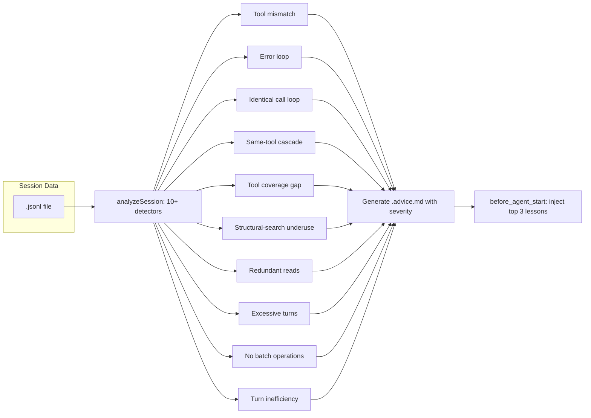

# Session Advice

{: .no_toc }

[📄 README](https://github.com/SchneiderDaniel/cheasee-pi/blob/main/.pi/extensions/session-advice/README.md)

**Why.** After every session, analyzes JSONL log for wasteful patterns — tool mismatches, error loops, redundant reads, cascade cascades — and generates `.advice.md` with fix recommendations. Past lessons auto-injected into next session's system prompt.

**How it works.** On session shutdown, reads `.jsonl` and runs 10+ waste signal detectors: bash-grep (bash|grep), bash-cat (bash cat), error-loop (2+ errors), identical-args (same tool+args 3x), redundant-reads (same file within 2 turns), structural-underuse (code read without AST search), no-batch (consecutive same-tool), turn-inefficiency (20+ calls no changes). Generates `latest.advice.md` with severity labels. Next `before_agent_start`: reads advice, extracts top 3 actions, appends to system prompt. `/session-advice report` generates aggregate waste report with histogram and detector improvement suggestions.

### Detected patterns

| Pattern | Severity | Example |
|---------|----------|--------|
| Tool mismatch | error | `bash | grep` instead of `ripgrep_search` |
| Error not actioned | error | Tool errors, retries same tool 4x |
| Identical call loop | error | Same tool+args 3x in last 12 calls |
| Same-tool cascade | warning | `bash` called 12x consecutively |
| Tool coverage gap | warning | Code files present but `structural_search` unused |
| Structural-search underuse | warning | 3+ code files read, `structural_search` never called |
| Redundant reads | warning | Same file read within 2 turns |
| Excessive turns | warning | 20+ tool calls with no file changes |

**Location:** `.pi/extensions/session-advice/`

## Details

### Architecture

Waste signal detection + LLM-based advice generation:

```
├── index.ts           # Entry: /session-advice command, lifecycle hooks, lesson injection
├── advisor.ts         # Pure waste signal detectors (10+ patterns)
├── llm-advisor.ts     # LLM-based advice generation from detected signals
├── advice-pipeline.ts # Orchestra: analyze → generate → write → symlink
├── symlink-manager.ts # latest.advice.md symlink management
└── test/              # Unit tests for all detectors
```

### Waste Detectors



### Detector Details

| Pattern | Severity | Detection Logic |
|---------|----------|-----------------|
| Tool mismatch | error | `bash | grep` instead of `ripgrep_search` |
| Error loop | error | 2+ consecutive tool errors, same tool, no action |
| Identical call loop | error | Same tool+args 3x in last 12 calls |
| Same-tool cascade | warning | 8+ consecutive same-tool calls |
| Tool coverage gap | warning | Code files present but `structural_search` unused |
| Structural underuse | warning | 3+ code files read, `structural_search` never called |
| Redundant reads | warning | Same file read within 2 turns |
| Excessive turns | warning | 20+ tool calls with zero file changes |
| No batch | warning | Consecutive same-tool calls not merged |
| Turn inefficiency | warning | 20+ calls per turn with no file changes saved |

### Key Design Decisions

- **Dual analysis path** — Pure function `analyzeSession()` parses JSONL for structured signals. LLM-based `advice-pipeline.ts` enriches signals with natural language recommendations.
- **Top-3 lesson injection** — On `before_agent_start`, reads `latest.advice.md`, extracts the first 3 `### Recommended Actions` items, and appends to system prompt. Prevents context overwhelm from all lessons.
- **Clean session detection** — If advice content includes "Clean session", no lessons are injected (no waste found).
- **Signal review lifecycle** — `/session-advice report` generates an aggregate report across all sessions. Review step proposes detector removals (low-value signals) and new detector additions. Creates GitHub issues for detector changes.
- **Session cleanup** — Report command offers to delete all session files (`.jsonl`, `.md`, `.metadata.json`, `.advice.md`). Keeps the `advice-report.md` and latest symlinks.
- **Cross-reference with systemPromptOptions** — If many tools configured (`>12`) but only a few used, suggests pruning unused tools from active set.
- **State persistence** — Enabled/disabled state stored in `.pi/state/session-extensions.json` with createExtensionStateStore.

### Advice File Format

Generated `latest.advice.md`:

```markdown
# Session Advice — <session_id>

**Total waste percentage:** 15.3%
**Wasted tokens:** ~12,450

## Waste Signals

| Signal | Severity | Count | Tokens Wasted |
|--------|----------|-------|---------------|
| bash | grep → ripgrep_search | error | 3 | ~600 |
| Redundant reads | warning | 5 | ~2,400 |

## Recommended Actions

- 🔴 **Use structural_search instead of read** when searching for code patterns. Found 3 cases where files were read then searched with grep.
- 🟡 **Batch same-tool calls** — 12 consecutive bash calls could be merged with `&&`.
- 🟢 **Set max_count on ripgrep_search** — search returned 500+ results but only 10 were needed.
```

### System Prompt Injection

On `before_agent_start`, if lessons exist:

```markdown
⚠️ Past Session Lessons (from session advisor)
  - Use structural_search instead of read for code pattern search
  - Batch same-tool calls with &&
  - Set max_count on ripgrep_search to limit results
```

### Testing

Tests cover:
- All 10+ waste signal detectors with mock session data
- Advice file parsing and top-3 extraction
- Lesson injection edge cases (clean session, no advice file, empty actions)
- Report generation: aggregate stats, histogram, detector improvement suggestions
- Symlink management: create, update, delete
- State persistence: toggle on/off, cross-session
