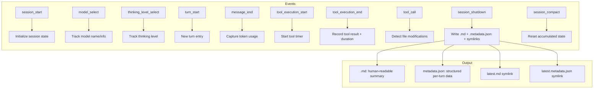

# Session Logger

{: .no_toc }

[📄 README](../../.pi/extensions/session-logger/README.md)

**Why.** Generates rich Markdown reports alongside pi's `.jsonl` session files — per-turn token breakdown, tool execution stats, file modifications, sub-agent output, and error summaries.

**How it works.** Hooks into session lifecycle (`session_start`, `session_shutdown`), turn events (`turn_start`, `turn_end`), message events (`message_end`), tool events (`tool_execution_start`, `tool_execution_end`, `tool_call`). Tracks: token in/out per turn, thinking tokens, tool execution duration, file modifications (write/edit). On shutdown, writes `.md` report and `.metadata.json` alongside the `.jsonl` file. Toggle with `/session-logger`. Trust-gated — only generates reports on trusted projects. Latest symlinks for easy access.

### Output formats

| Format | File | Description |
|--------|------|-------------|
| JSONL | `.pi/sessions/<datetime>_<uuid>.jsonl` | Event stream per session |
| Markdown | `.pi/sessions/<sessionId>.md` | Human-readable session summary |
| Metadata | `.pi/sessions/<sessionId>.metadata.json` | Structured session metadata |
| Advice | `.pi/sessions/<sessionId>.advice.md` | Improvement recommendations |
| Latest symlinks | `.pi/sessions/latest.*` | Convenience symlinks |

Reports include sub-agent output from supervisor pipeline agents (developer, auditor, researcher, test-designer) with agent header, status, tool count, token count, duration, and audit score.

**Location:** `.pi/extensions/session-logger/`

## Details

### Architecture

Event-driven pipeline with report generation:

```
├── index.ts      # Entry: command registration (/session-logger), event wiring, gate management
├── pipeline.ts   # LoggerPipeline: event handlers, state accumulation, report writing
├── report.ts     # Markdown report builder, metadata JSON builder, latest symlink management
├── types.ts      # SessionLoggerGate, tool/event state interfaces
└── test/         # Pipeline + report generator tests
```

### Event Flow



### Report Sections (Markdown)

The generated `.md` report includes:

```markdown
# Session Report: <session_id>

## Overview
- Duration: <elapsed>
- Model: <model_name>
- Total Turns: <N>
- Total Tokens: <in>/<out>/<thinking>
- Total Tool Calls: <N>
- Errors: <N>
- Files Modified: <N>

## Turn-by-Turn Breakdown
| Turn | Tokens In | Tokens Out | Thinking | Tools | Duration |
|------|-----------|------------|----------|-------|----------|
| 1    | ...       | ...        | ...      | ...   | ...      |

## Tool Calls
| Tool | Args | Duration | Status |
|------|------|----------|--------|

## File Modifications
| File | Action |
|------|--------|

## Sub-Agent Output (supervisor)
- Agent: developer → toolCount, tokenCount, duration
- Agent: auditor → toolCount, tokenCount, duration, auditScore

## Errors
- <error messages>
```

### Key Design Decisions

- **Toggle between sessions** — `/session-logger on|off` takes effect on NEXT session start. Current session unaffected. State persisted in `.pi/state/session-extensions.json`.
- **Trust-gated** — Reports only generated on trusted projects. `isProjectTrusted()` checked on `session_shutdown`. Untrusted projects skip report generation entirely.
- **Latest symlinks** — `latest.md`, `latest.metadata.json`, `latest.jsonl` symlinks for easy access. Created on each session shutdown. Overwrite previous latest.
- **File modification tracking** — Intercepted at `tool_call` level for `write`/`edit` tools. Tracked as `{ file, action, timestamp }` entries.
- **Sub-agent output** — Extracts structured output from supervisor pipeline agents (developer, auditor, researcher, test-designer) including agent name, tool count, token count, duration, and audit score.
- **Compact support** — `session_compact` event resets accumulated state but preserves session file.

### Testing

Tests cover:
- Pipeline: all event handlers, state accumulation, write
- Report generator: markdown formatting, metadata JSON, symlink creation
- Gate: toggle on/off, persistence, cross-session state
- File modification tracking: write/edit detection, multiple files
- Sub-agent output parsing: structured JSON extraction
