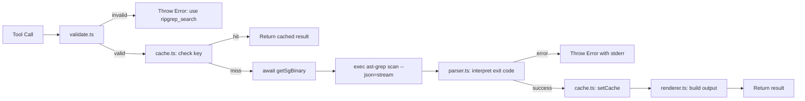

# Structural Analyzer

{: .no_toc }

[📄 README](https://github.com/SchneiderDaniel/cheasee-pi/blob/main/.pi/extensions/structural-analyzer/README.md) — [`@cheasee-pi/structural-analyzer` on npm](https://www.npmjs.com/package/@cheasee-pi/structural-analyzer)

**Why.** AST-aware code pattern search via ast-grep — finds function calls, class definitions, try/catch blocks, method invocations without noise from comments or strings. Prevents "find definitions by grep" anti-pattern.

**How it works.** Registers `structural_search` tool with S-expression and code-snippet pattern syntax (`$META_VAR` for single nodes, `$$$MULTI` for zero-or-more). Optional language parameter auto-detects from project config files (tsconfig.json → typescript, go.mod → go, etc.). Rejects single-word text patterns — redirects those to `ripgrep_search`. Results cached by (pattern, language, cwd). Streaming for >100 matches returns truncated summary with total count. TUI mode renders clickable `file://` hyperlinks.

**Location:** `.pi/extensions/structural-analyzer/`

## Details

### Architecture

Structural Analyzer wraps ast-grep Tree-sitter search into a pi tool (`structural_search`). The codebase is modular — 6 files, 1 entry point, 5 pure-function modules:

```
├── index.ts        # Entry: tool registration, execute orchestration, event hooks
├── types.ts        # SgMatch, SgResult, ExecResultResponse interfaces
├── cache.ts        # FIFO-bounded Map cache (200 entries), keyed by pattern+language+cwd
├── language.ts     # Auto-detect language from sgconfig.yml / tsconfig.json / pyproject.toml / go.mod / Cargo.toml
├── parser.ts       # NDJSON stream parser, exit-code-based error interpretation, 100-match streaming threshold
├── validate.ts     # Pattern validation: rejects single-word text patterns, requires structural syntax ($, {, (, [)
└── renderer.ts     # TUI renderer: OSC 8 hyperlinks, expanded/collapsed views, truncation notices
```

### Execution Flow



### Key Design Decisions

- **Binary detection via lazy promise** — `getSgBinary()` caches the `ast-grep --version` check as a module-level promise. All concurrent callers await the same promise. On failure, the promise resets so next caller retries (transient fault recovery).
- **FIFO eviction, not LRU** — Cache uses simple FIFO eviction at 200 entries. Hot-spot patterns may evict cold entries first. Revisit LRU when usage data exists.
- **Null-byte cache key separator** — `${pattern}\x00${language}\x00${cwd}` prevents collision when inputs contain `::`.
- **Exit-code-based error interpretation** (not keyword heuristics) — code 0 = success, code 1 + empty stderr = no matches, all other non-zero = real errors. Stderr presence overrides success interpretation.
- **Streaming threshold at 100 matches** — results beyond 100 are truncated with a clear notice and `totalMatches` count. Refine pattern to narrow.
- **Language auto-detection** — checks 5 config files in priority: `sgconfig.yml` > `tsconfig.json` > `pyproject.toml` > `go.mod` > `Cargo.toml`. For `sgconfig.yml`, uses a naive line-based `languageGlobs:` parser (not a full YAML parser).
- **Naive YAML parser limitations** — Only extracts first key under `languageGlobs:`. Does not handle folded scalars (`>`), literal blocks (`|`), anchors, aliases, or complex keys. Acceptable because project `sgconfig.yml` files never use complex values.

### Renderer Adaptation

The TUI renderer (`renderer.ts`) shows:
- Summary: "Structural search: N matches"
- Each match: hyperlinked file path (OSC 8 `file://`), line range, truncated snippet
- Collapsed view: 5 matches default; expanded view: 20 matches
- Truncation notice when total exceeds displayed count
- Non-TUI modes: raw text pass-through without ANSI/OSC8 sequences

### Testing

Tests cover:
- NDJSON parsing from ast-grep `--json=stream` output
- Exit code interpretation (0, 1 empty, 1 with stderr, 2+)
- Cache FIFO eviction boundary (200 entries)
- Pattern validation (empty, single-word, structural syntax)
- Language auto-detection mock paths
- YAML `languageGlobs` extraction
