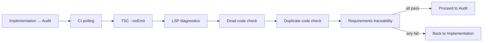

# Supervisor

{: .no_toc }

[📄 README](../../.pi/extensions/supervisor/README.md)

**Why.** Autonomous Kanban pipeline driving 5 agents (Researcher → Architect → TestDesigner → Developer → Auditor) through GitHub Project board status transitions. Creates worktrees, manages quality gates, creates PRs. Full development lifecycle automation.

**How it works.** Triggered via `/supervisor <issue-number>`. Reads config from `.pi/settings.json`. Fetches GitHub issue, filters by trusted codeowners. Research dedup gate — if `## Research Findings` already exists in issue comments, researcher is skipped. Creates git worktree at `../<branch-prefix><issue-number>/`. Dispatches agents per board status. Structured JSON agent output with `action`, `findings`, `commentBody`, and `targetStatus` for feedback loops. Posts results as GitHub comments, moves board cards. Pre-transition quality gates between Implementation and Audit. Auditor approves/rejects with structured findings across 8 audit dimensions. Score computed deterministically — must meet `auditScoreThreshold` (default 0.75). Rejected issues cycle back to Implementation. Creates PR on approval.

---

## Quick start

1. Ensure `.pi/settings.json` has a `supervisor` block (see [Configuration](#configuration))
2. Open an issue on your repo
3. Assign it to the **Backlog** column on your project board
4. Type `/supervisor <issue-number>` in pi

The pipeline runs agent-by-agent, posting GitHub comments at each stage. You watch it live in the chat. When done, a PR is waiting.

---

## Pipeline overview

The pipeline processes issues through 6 stages, each mapped to a project board column:

```
Backlog → Research → Architecture → TestDesign → Implementation → Audit → Done
```

```
     ┌────────┐   ┌──────────┐   ┌─────────┐   ┌────────────┐   ┌────────┐
     │Research│   │Architect │   │TestDes. │   │Implement.  │   │Auditor │
     └───┬────┘   └───┬──────┘   └────┬────┘   └─────┬──────┘   └───┬────┘
         │            │               │              │              │
         ▼            ▼               ▼              │              ▼
    GitHub Comment    Comment         Comment        │         GitHub Comment
    ## Research       ## Architecture ## Test Plan    │         ## Audit (approve/reject)
         │            │               │              │              │
         └────────────┴───────────────┴──────────────┘              │
                                                              ┌─────▼──────────┐
                                                              │ QUALITY GATES  │
                                                              │ CI → TSC → LSP │
                                                              │ Dead → Dup →   │
                                                              │ Traceability   │
                                                              └───────┬────────┘
                                                                      │
                                                              ┌───────▼────────┐
                                                              │ PR creation    │
                                                              │ (audit report  │
                                                              │  as body)      │
                                                              └────────────────┘
```

Each stage dispatches a dedicated agent. The agent outputs structured JSON, which the pipeline parses to decide the next status. On approval, a PR is created with the audit report as body.

---

## Agents

| Stage | Agent | What it does | Output |
|-------|-------|-------------|--------|
| **Research** | `researcher` | Gathers context: codebase docs, web search, existing patterns | GitHub comment with `## Research Findings` |
| **Architecture** | `architect` | Designs architecture, identifies components, plans changes | GitHub comment with `## Architecture` |
| **TestDesign** | `test-designer` | Writes test plan | GitHub comment with `## Test Plan` |
| **Implementation** | `developer` | Writes code, commits and pushes to worktree branch | Git commit + push |
| **Audit** | `auditor` | Reviews code against 8 dimensions, approves or rejects | GitHub comment + structured findings |

### Research dedup gate

If the issue already has a `## Research Findings` heading in any comment or body, the researcher is **skipped entirely**. The pipeline infers Architecture as next status directly. This prevents redundant research on re-queued issues.

### Agent output protocol

Every agent outputs a final JSON message:

```jsonc
// Non-auditor agents
{ "action": "COMPLETE", "agentName": "developer",
  "summary": "...", "commentBody": "## Implementation\n\n..." }

// Auditor
{ "action": "APPROVED" | "REJECTED", "agentName": "auditor",
  "commentBody": "## Audit Approved\n\n...",
  "auditScore": { "passing": 10, "total": 10 },
  "findings": [
    { "severity": "critical", "dimension": "code-quality", "message": "..." }
  ],
  "prTitle": "feat(#N): title", "prBody": "## PR Description\n\n..." }
```

The pipeline parses the JSON from code fences or brace pairs. It falls back to text markers (`ARCHITECTURE_COMPLETE`, `FEEDBACK_RESEARCH`, etc.) and section headings (`## Audit Approved`) for backward compatibility.

**`targetStatus`** — Any agent can emit `{ "targetStatus": "Research" }` to override the normal forward flow. This enables feedback loops (see below).

### Agent definitions

Each agent's capabilities are defined in `.pi/extensions/supervisor/agents/<agent>.md` with YAML frontmatter:

```yaml
---
tools: [read, bash, structural_search, ripgrep_search]
extensions: [agent-harness, caveman, piignore, ripgrep-search, scrapling, structural-analyzer, web-search]
skills: [ponytail]
model: opencode-go/deepseek-v4-flash
thinking: high
entryMarker: Architecture
outputFormat: structured-json
---
```

---

## Quality gates (pre-transition hooks)

Before moving from Implementation → Audit, 6 gates run in sequence. Any gate failure sends the issue back to Implementation with a combined failure note. The developer sees everything wrong at once.



### 1. CI gating

Polls GitHub check runs for the worktree branch via `gh api repos/<repo>/commits/<sha>/check-runs`. Polls every 15s up to `ciGatingTimeoutSec` (default 300s).

| Result | Action |
|--------|--------|
| All checks pass | Proceed |
| Any check fails | Block → Implementation |
| Checks still pending at timeout | Warning, proceed to audit |
| No checks configured | Skip silently |
| `gh api` error | Warning, proceed to audit |

If the branch SHA isn't on remote yet (push still in flight), the gate attempts **push recovery**: it pushes the branch from worktree, then retries SHA resolution.

### 2. TSC checkpoint

Runs `npx tsc --noEmit` on the worktree. Caches diagnostics across calls. Tracks error trend (regression/improvement/stable).

### 3. LSP pre-audit

Runs real LSP diagnostics on modified files only (files changed since `defaultBranch`). Groups by extension: `.ts` → `typescript-language-server`, `.py` → `pylsp`, `.rs` → `rust-analyzer`, `.go` → `gopls`. Retries up to 3 times.

### 4. Dead code gate

Runs `knip` on the full worktree, filters to changed files. Detects unused exports, orphaned imports, dead branches, zombie dependencies. If `knip` isn't installed, degrades gracefully with a `no_knip` status.

### 5. Duplicate code gate

Runs `jscpd` on the full worktree, filters to changed files. Classifies clones as exact (Type 1), renamed (Type 2), or near-miss (Type 3). If `jscpd` isn't installed, degrades gracefully with a `no_jscpd` status.

### 6. Requirements traceability gate

Cross-references the issue checklist against the implementation diff. Runs 5 deterministic checks: checklist keyword coverage, test-file parity, imperative verb direction, file count sanity, comment referencing.

### Gate failure notes

- **Gate failures do NOT count as Auditor rejections.** The `maxRejections` counter tracks only explicit auditor REJECT decisions. A gate-bounced issue restarts Implementation with full context, not a consumed rejection slot.
- **All gates run regardless of prior failures.** The combined note includes every failing gate, so the developer fixes everything at once.
- **When gates block**, the user sees a chat message like `"🔴 Pre-Transition Gates Blocked — Returning to Developer"` with the failure details.

---

## Feedback loops

The pipeline supports two feedback loops:

### Architect → Research

If research findings are insufficient, the architect can send the pipeline back:

- Text: output `FEEDBACK_RESEARCH`
- JSON: output `{ "action": "COMPLETE", "targetStatus": "Research" }`

The researcher is re-dispatched with the architect's feedback as context. This prevents bad research from contaminating TestDesign, Implementation, and Audit.

### Auditor → Implementation

When the auditor REJECTs, the issue goes back to Implementation for fixes. The developer receives the auditor's structured findings as `gateFailureContext` in their next prompt. This continues until the auditor approves or `maxRejections` is exceeded.

```
Loop 1: Developer → gates → Auditor REJECTS
          ↓
Loop 2: Developer (fixes) → gates → Auditor APPROVES → PR created
```

---

## Worktree lifecycle

Each pipeline run gets its own isolated git worktree:

```
┌─────────────────┐
│ Create Worktree  │  git worktree add -b <branch> <path> <base>
│                  │  Fallbacks: branch exists → add without -b
│                  │             dir exists → use existing
└────────┬────────┘
         ▼
┌─────────────────┐
│ Setup            │  .pi/git/ copied → git submodule update --init
│                  │  → npm ci (2 attempts, non-blocking)
└────────┬────────┘
         ▼
┌─────────────────┐
│ Agents run here  │  All 5 agents execute in worktree CWD
│ (up to 20 loops) │
└────────┬────────┘
         ▼
┌─────────────────┐
│ Post-pipeline    │  Merge conflict check → worktree cleanup
│                  │  (preserved if debug + PR failure)
└─────────────────┘
```

The worktree is the sandbox. Agents can write, edit, and commit freely without affecting the main repo. On crash or signal, the worktree is cleaned up automatically.

---

## Configuration

Settings live under the `supervisor` key in `.pi/settings.json`:

```json
{
  "supervisor": {
    "repo": "owner/repo",
    "projectNumber": 1,
    "statusField": "Status",
    "statusMapping": {
      "Research": "researcher",
      "Architecture": "architect",
      "TestDesign": "test-designer",
      "Implementation": "developer",
      "Audit": "auditor"
    },
    "defaultBranch": "main",
    "branchPrefix": "worktree-git-issue-",
    "codeowners": ["your-github-username"],
    "maxRejections": 3,
    "auditScoreThreshold": 0.75,
    "ciGatingTimeoutSec": 300,
    "agentTokenBudget": 300000,
    "maxToolCalls": 0,
    "agentTimeoutsMin": {},
    "bellOnComplete": false,
    "enableExperimentalFeatures": false
  }
}
```

### Required fields

| Field | What it does |
|-------|-------------|
| `repo` | GitHub repo (owner/name) for issue fetching and PR creation |
| `projectNumber` | GitHub Project board number |
| `statusMapping` | Maps board column names to agent `.md` files |
| `codeowners` | List of trusted GitHub usernames. Only issues by these authors are processed |

### Optional fields

| Field | Default | What it does |
|-------|---------|-------------|
| `defaultBranch` | `main` | Base branch for worktree and PR target |
| `branchPrefix` | `worktree-git-issue-` | Prefix for worktree branch names |
| `maxRejections` | `3` | Max auditor rejections before pipeline stops |
| `auditScoreThreshold` | `0.75` | Minimum passing/total ratio for audit score gate |
| `ciGatingTimeoutSec` | `300` | Seconds to poll CI before giving up. `0` = skip CI gate entirely |
| `agentTokenBudget` | `0` | Soft token cap per agent dispatch. `0` = unlimited |
| `maxToolCalls` | `0` | Hard cap on tool invocations per agent. `0` = unlimited |
| `agentTimeoutsMin` | `{}` | Per-agent timeouts in minutes: `{ "developer": 30 }` |
| `bellOnComplete` | `false` | Ring terminal bell when pipeline finishes |
| `enableExperimentalFeatures` | `false` | When false, only core pipeline stages run |

---

## Audit score

The auditor evaluates code across 8 dimensions:

- `architecture-compliance`
- `ticket-fulfillment`
- `test-quality`
- `correctness-safety`
- `code-quality`
- `completeness`
- `duplicate-code`
- `research-incorporation`

Each finding has a `severity` and `dimension`. A dimension fails if it has any finding with severity `critical` or `warning` (suggestions don't count). The score is `passing / total` — must meet `auditScoreThreshold` (default 0.75).

If the researcher was skipped by the dedup gate, `research-incorporation` is excluded (7 dimensions).

When the score gate fails, a `## Audit Score Gate Rejected` comment is posted on the issue and the pipeline returns to Implementation.

---

## Detailed pipeline flow

### Phase 0: Entry and gating

```
handleSupervisorCommand(args, ctx, pi)

1. Trust check       → ctx.isProjectTrusted()
2. Parse args        → /supervisor [--debug] <issue-number>
3. Load config       → .pi/settings.json → SupervisorConfig
4. Fetch issue       → gh issue view <N> --json ...
5. Filter by owner   → only codeowners' issues pass
6. Read board        → find project, column, status field
7. Check deps        → blocked by open PRs/issues?
8. Create worktree   → git worktree add ...
9. Setup             → .pi/git copy → git submodule init → npm ci
10. Register crash   → SIGTERM/SIGINT cleanup handlers
```

### Phase 1: Main loop

The pipeline loops through stages (max 20 iterations):

```
for each iteration:

  1. Resolve current status from board
  2. Backlog? → auto-move to Research, continue
  3. Done? → break, pipeline complete
  4. Load agent → agents/<agent>.md
  5. Build task → inject per-agent context
  6. Execute agent → spawn pi --mode json subprocess
  7. Post-agent → comment (non-developer) or commit+push (developer)
  8. Parse output → structured JSON or text markers
  9. Calculate next status → forward, backward, or stop
  10. Pre-transition hooks → quality gates (if Implementation→Audit)
  11. Status transition → move board card
```

### Phase 2: Post-pipeline

After the loop ends (Done, error, or max rejections):

```
1. Merge conflict check → if PR has conflicts, attempt auto-merge
2. Worktree cleanup    → git worktree remove + branch -D
3. Checkpoint delete
```

### Phase 3: Summary

A summary message is sent with agent stats (duration, tokens, tools, model), PR link, stop reason, and gate failure history.

---

## Edge cases

### Configuration

| Problem | What happens |
|---------|-------------|
| No `.pi/settings.json` | Pipeline throws |
| Missing `supervisor.repo` | Pipeline throws |
| Missing `supervisor.codeowners` | Pipeline throws |
| Invalid `auditScoreThreshold` | Pipeline throws |

### GitHub API

| Problem | What happens |
|---------|-------------|
| Issue not found | "Issue #N not found" → stops |
| Token missing project scope | "GitHub token missing 'project' scope" → stops |
| Issue not on board | "Issue #N not on project board #P" → stops |
| `gh api` errors mid-flight | Warnings in error collector, pipeline continues |

### Agent execution

| Problem | What happens |
|---------|-------------|
| Agent `.md` not found | Pipeline stops |
| Agent subprocess times out | SIGTERM → killed, pipeline stops |
| Budget exceeded | Kill subprocess. Researcher: graceful degradation (partial findings posted). Others: pipeline stops |
| Agent produces no output | `"Output is empty"` → stops |
| Agent refuses | `"Agent refused: ..."` → stops |
| Agent fails with no explicit marker | Pipeline stops (Bug #643 fix: prevents crash-loop) |

### Developer-specific

| Problem | What happens |
|---------|-------------|
| `commitAndPush` fails | Pipeline stops |
| No changes to commit | Pipeline continues (no-op commit skipped) |
| Developer→Audit: worktree has no commits | Issue closed as "already resolved" |

### Quality gates

| Gate | Problem | What happens |
|------|---------|-------------|
| CI | Checks fail | Block → Implementation |
| CI | Checks pending > timeout | Warning → proceed to audit |
| CI | Unconfigured | Skip |
| Dead code | Found | Block → Implementation + uncommit |
| TSC | Error | Block → Implementation |
| LSP | Error | Block → Implementation |
| Dup code | Results | Stored for auditor context (non-blocking) |
| Package safety | Blocked packages | Warning → auditor may flag |
| Traceability | Gaps | Warning → auditor reviews |

### Crash recovery

| Problem | What happens |
|---------|-------------|
| Pipeline process SIGTERM | Cleanup worktree, delete branch, exit(0) |
| Pipeline process SIGINT | Same as SIGTERM |
| Double signal (SIGTERM + SIGINT) | `exit(1)` immediately |
| Stale checkpoint found on restart | `git worktree prune` + delete + `rm -rf` |
| Checkpoint older than 1h | Treated as stale |

---

## Workflow config

The pipeline is driven by a data structure in `config/workflow.ts`:

```typescript
[
  { status: "Backlog",      builtIn: "backlog" },

  { status: "Research",     agentName: "researcher",
    markerMap: { RESEARCH_COMPLETE: "Architecture" } },

  { status: "Architecture", agentName: "architect",
    markerMap: { ARCHITECTURE_COMPLETE: "TestDesign",
                 FEEDBACK_RESEARCH: "Research" },
    canLoopBackTo: ["Research"] },

  { status: "TestDesign",   agentName: "test-designer",
    markerMap: { TEST_PLAN_COMPLETE: "Implementation" } },

  { status: "Implementation", agentName: "developer",
    markerMap: { IMPLEMENTATION_COMPLETE: "Audit" },
    hooks: ["ci", "tsc", "lsp", "dup", "trace"] },

  { status: "Audit",        agentName: "auditor",
    markerMap: { "AUDIT_DECISION: APPROVED": "Done",
                 "AUDIT_DECISION: REJECTED": "Implementation",
                 AUDIT_APPROVED: "Done",
                 AUDIT_REJECTED: "Implementation" },
    canLoopBackTo: ["Implementation"],
    maxRejections: 5 },

  { status: "Done",         builtIn: "done" },
]
```

Each step specifies:
- **status** — Board column that triggers this step
- **agentName** — Which agent `.md` file to load
- **markerMap** — Text markers in agent output that determine next status
- **canLoopBackTo** — Valid backward transitions (feedback loops)
- **hooks** — Pre-transition quality gates
- **maxRejections** — Max times this step can loop back before human intervention
- **builtIn** — For non-agent steps (backlog auto-move, terminal state)

---

## File structure

```
.pi/extensions/supervisor/
├── index.ts                # Entry: command registration, pipeline lifecycle
├── pipeline/               # Pipeline orchestration
│   ├── handler.ts          # Main loop: agent dispatch, status transitions
│   ├── stages.ts           # Stage-level operations (comment posting, commits)
│   ├── audit.ts            # Pre-transition quality gates
│   ├── execute-agent.ts    # Agent subprocess management
│   ├── worktree.ts         # Worktree creation and setup
│   ├── merge.ts            # Post-pipeline merge conflict resolution
│   ├── pr-creation.ts      # PR creation flow
│   ├── output.ts           # Pipeline output helpers
│   ├── notifications.ts    # Summary and warnings messages
│   ├── state-checkpoint.ts # Crash recovery checkpoints
│   ├── crash-cleanup.ts    # Signal handlers for graceful shutdown
│   ├── helpers.ts          # Shared utilities
│   └── error-collector.ts  # Warning/error aggregation
├── agents/                 # Agent definitions (MD files with YAML frontmatter)
├── config/
│   ├── config.ts           # Settings loading and validation
│   ├── types.ts            # Type definitions
│   └── workflow.ts         # Stage transitions, marker resolution, audit scoring
├── github/                 # GitHub API wrappers
├── agent/                  # Agent subprocess runner and output parser
├── checks/                 # Quality gate implementations
│   ├── ci-gating.ts        # GitHub check runs polling
│   ├── duplicate-code.ts   # jscpd integration
│   ├── dead-code.ts        # knip integration
│   ├── package-safety.ts   # npm package age verification
│   ├── requirements-traceability.ts   # shim → requirements/
│   ├── requirements/                  # split traceability gate modules
│   │   ├── index.ts                   # runRequirementsTraceability orchestrator
│   │   ├── types.ts                   # shared gap/issue contracts
│   │   ├── parse.ts                   # issue body checklist parsing
│   │   ├── title.ts                   # title verb + diff direction
│   │   ├── diff.ts                    # git diff acquisition/parsing
│   │   ├── coverage.ts                # checklist keyword coverage
│   │   ├── parity.ts                  # test file parity
│   │   └── cleanup.ts                 # old reference cleanup
│   └── audit-gate-decision.ts
├── session/                # Session management, result types
├── subagent/               # Sub-agent dispatch utilities
├── lib/                    # Shared utilities
└── test/                   # Integration tests
```

---

## Testing

Integration tests cover:
- Full pipeline with mock GitHub API
- Agent dispatch with structured JSON output parsing
- Quality gates (each gate tested independently)
- Worktree creation and cleanup lifecycle
- Status transition edge cases (backward transitions, max rejections, dedup gates)
- Submodule handling with matched-branch pattern
