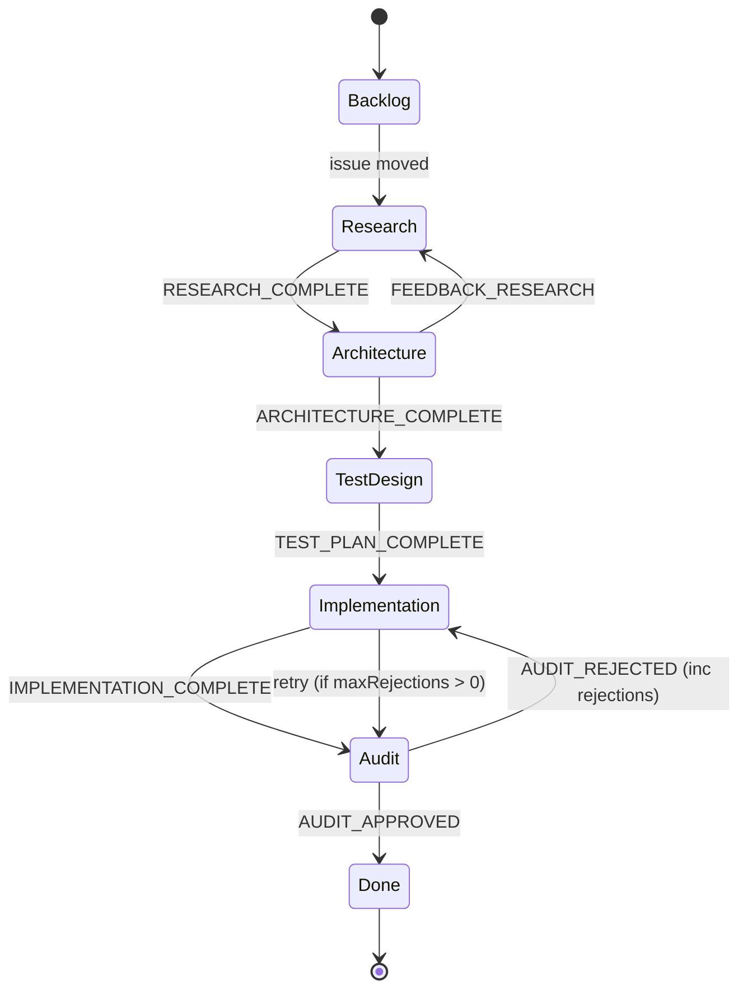
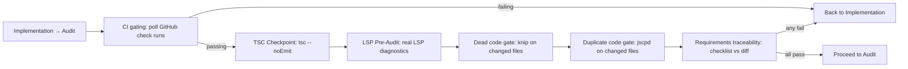

# Supervisor

{: .no_toc }

[📄 README](https://github.com/SchneiderDaniel/cheasee-pi/blob/main/.pi/extensions/supervisor/README.md)

**Why.** Autonomous Kanban pipeline driving 5 agents (Researcher → Architect → TestDesigner → Developer → Auditor) through GitHub Project board status transitions. Creates worktrees, manages quality gates, creates PRs. Full development lifecycle automation.

**How it works.** Triggered via `/supervisor <issue-number>`. Reads config from `.pi/settings.json` (repo, project number, status mapping, codeowners). Fetches GitHub issue, filters by trusted codeowners. Research dedup gate — if `## Research Findings` already exists in issue comments, researcher is skipped. Creates git worktree at `../<branch-prefix><issue-number>/`. Dispatches agents per board status — each agent reads its definition from `.pi/extensions/supervisor/agents/<agent>.md` (YAML frontmatter defining tools, extensions, skills, model). Supports structured JSON agent output with `action`, `findings`, `commentBody`, and `targetStatus` for feedback loops. Posts results as GitHub comments, moves board cards. Pre-transition quality gates between Implementation and Audit: **CI gating** (poll GitHub check runs), **TSC** (`tsc --noEmit`), **LSP** (real LSP diagnostics), **dead-code** (knip on changed files), **duplicate-code** (jscpd on changed files), **requirements traceability** (checklist vs diff cross-reference). Auditor approves/rejects with structured findings across 8 audit dimensions. Score computed deterministically — must meet `auditScoreThreshold` (default 0.75). Rejected issues cycle back to Implementation (max `maxRejections` default 3). Creates PR on approval. Supports submodules with matched-branch pattern. Token budgets, tool call limits, per-agent timeouts.

### Agent definitions

| Agent | Tools | Extensions | Skills | Thinking | Entry Marker | Output Format |
|-------|-------|------------|--------|----------|-------------|---------------|
| **Researcher** | read, bash, structural_search, ripgrep_search, web_search | agent-harness, caveman, piignore, ripgrep-search, scrapling, structural-analyzer, web-search | — | medium | `Research` | Structured JSON + GitHub comment |
| **Architect** | read, bash, structural_search, ripgrep_search | agent-harness, caveman, piignore, ripgrep-search, scrapling, structural-analyzer | `extension-spec` | high | `Architecture` | Structured JSON + GitHub comment |
| **TestDesigner** | read, bash, structural_search, ripgrep_search | agent-harness, caveman, piignore, ripgrep-search, scrapling, structural-analyzer | — | medium | `TestDesign` | Structured JSON + GitHub comment |
| **Developer** | read, bash, write, edit, structural_search, ripgrep_search | agent-harness, caveman, format-on-save, piignore, ripgrep-search, scrapling, tsc-checkpoint, structural-analyzer, worktree-sandbox | `extension-spec` | medium | `Implementation` | Structured JSON + Git commit + push |
| **Auditor** | read, bash, structural_search, ripgrep_search | agent-harness, caveman, piignore, ripgrep-search, scrapling, structural-analyzer, worktree-sandbox | `extension-duplicate-code-hunter`, `extension-dead-code-hunter` | high | `Audit` | Structured JSON with APPROVED/REJECTED + findings |

All agents use `opencode-go/deepseek-v4-flash` model. Each agent outputs structured JSON (`{ action, agentName, commentBody, findings?, auditScore?, targetStatus? }`) with text-marker fallback for backward compatibility.

### Pipeline flow

```
     ┌────────┐ ┌──────────┐ ┌─────────┐ ┌────────────┐ ┌────────┐
     │Research │ │Architect │ │TestDes. │ │Implement.  │ │Auditor │
     └───┬─────┘ └───┬──────┘ └────┬────┘ └─────┬──────┘ └───┬────┘
         │           │             │            │            │
    ┌────▼────┐ ┌───▼──────┐ ┌─────▼────┐      │   ┌────────▼────┐
    │ Researcher│ │Architect  │ │TestDesigner│    │   │   Auditor    │
    │ (dedup:  │ │proposes   │ │writes test │    │   │   reviews    │
    │ skip if  │ │architecture││plan        │    │   │   structured │
    │ findings │ │can loop   │ │            │    │   │   findings   │
    │ exist)   │ │→ Research │ │            │    │   │   8 dims     │
    └────┬─────┘ └───┬──────┘ └────┬────────┘    │   └──────┬──────┘
         │           │             │              │          │
         ▼           ▼             ▼              │          ▼
    GitHub Comment GitHub Comment  GitHub Comment │   GitHub Comment
    ## Research   ## Architecture  ## Test Plan    │   ## Audit (approve/reject)
         │           │             │              │          │
         └───────────┴─────────────┴──────────────┘          │
                                                       ┌─────▼──────────┐
                                                       │ QUALITY GATES  │
                                                       │ (pre-transition)│
                                                       │ ┌────────────┐ │
                                                       │ │ CI polling │ │
                                                       │ │ TSC --noEmit│ │
                                                       │ │ LSP diags  │ │
                                                       │ │ Dead code  │ │
                                                       │ │ Dup code   │ │
                                                       │ │ Traceability│ │
                                                       │ └────────────┘ │
                                                       └───────┬────────┘
                                                               │
                                                    ┌──────────▼────────┐
                                                    │ PR creation       │
                                                    │ (audit report     │
                                                    │  as body)         │
                                                    └───────────────────┘
```

Before transitioning Implementation → Audit, the supervisor runs pre-transition gates in order:

1. **CI gating** (`ciGatingTimeoutSec`, default 300s) — Polls GitHub check runs for the branch using `gh api`. Returns `passing`, `failing`, `pending`, or `unconfigured`. If `failing`, short-circuits back to Implementation. If `unconfigured` or `error`, fails open (gate allows pipeline to proceed). Supports push recovery if branch SHA not found on remote.
2. **TSC Checkpoint** — `npx tsc --noEmit` on the worktree using TypeScript's watch compiler API. Cached diagnostics across calls. Error trend tracking (regression/improvement/stable).
3. **LSP Pre-Audit** — Real LSP diagnostics on modified files only (`git diff <defaultBranch> --name-only`). Groups by extension: `.ts` → `typescript-language-server`, `.py` → `pylsp`, `.rs` → `rust-analyzer`, `.go` → `gopls`. Retries up to 3 times with session-stored counters.
4. **Dead code gate** — Runs `knip` on the full worktree, filters to changed files only (`git diff <defaultBranch> --name-only`). Detects: unused exports, orphaned imports, dead branches, zombie dependencies. Gracefully degrades with `no_knip` status if knip unavailable.
5. **Duplicate code gate** — Runs `jscpd` on the full worktree, filters to changed files. Classifies clones as exact (Type 1), renamed (Type 2), or near-miss (Type 3). Gracefully degrades with `no_jscpd` status if jscpd unavailable.
6. **Requirements traceability gate** — Cross-references issue checklist against implementation diff. Runs 5 deterministic checks: checklist keyword coverage, test-file parity, imperative verb direction, file count sanity, and comment referencing.

If any gate fails, the issue goes back to Implementation. Gate failures do NOT count as Auditor rejections. Gate failure context is accumulated in `gateFailureHistory` and included in the final PR body for human review.

### Loop rules

- **Research dedup gate** — If issue already has `## Research Findings` in comments or body, researcher is skipped entirely
- **Architect feedback loop** — Architect can target status `Research` via `targetStatus` in structured output, sending pipeline back for more research
- **Auditor rejection** — Auditor rejects → sends back to Implementation (counts as 1 rejection toward `maxRejections`)
- **`maxRejections`** (default `3`) — Stops the loop when exceeded, forcing human intervention
- **`agentTokenBudget`** — Soft token cap per agent (0 = unlimited). Applied per agent dispatch.
- **`maxToolCalls`** — Hard cap on tool invocations per agent (0 = unlimited). Applied per agent dispatch.
- **`ciGatingTimeoutSec`** — CI polling timeout (default 300s, 0 = skip CI gate)
- **Audit score gate** — Auditor score must meet `auditScoreThreshold` (default 0.75). Score computed deterministically from findings across 8 dimensions.
- **`enableExperimentalFeatures`** — When false, only core pipeline stages run

### Pipeline flow details

The actual config-driven workflow (`config/workflow.ts`) defines precise stage transitions:

| Status | Agent | Forward markers | Backward markers | Max rejections | Hooks |
|--------|-------|-----------------|------------------|---------------|-------|
| Backlog | (built-in) | — | — | — | — |
| Research | researcher | `RESEARCH_COMPLETE` → Architecture | — | — | — |
| Architecture | architect | `ARCHITECTURE_COMPLETE` → TestDesign | `FEEDBACK_RESEARCH` → Research | — | — |
| TestDesign | test-designer | `TEST_PLAN_COMPLETE` → Implementation | — | — | — |
| Implementation | developer | `IMPLEMENTATION_COMPLETE` → Audit | — | — | ci, tsc, lsp, dup, trace |
| Audit | auditor | `AUDIT_DECISION: APPROVED` / `AUDIT_APPROVED` → Done | `AUDIT_DECISION: REJECTED` / `AUDIT_REJECTED` → Implementation | 5 | — |
| Done | (built-in) | — | — | — | — |

**Fallback resolution:** If no structured marker is found, the pipeline falls back to section heading detection (`## Audit Approved` / `## Audit Rejected`), then to legacy text markers, then to inference: bare `COMPLETE` on Audit defaults to APPROVED.

**Location:** `.pi/extensions/supervisor/`

## Details

### Architecture

Large extension (50+ source files) organized into workstreams:

```
├── index.ts        # Entry: command registration, pipeline lifecycle
├── pipeline/       # Pipeline orchestration: status resolution, agent dispatch, gates
├── agents/         # Agent definitions (MD files with YAML frontmatter)
├── config/         # Workflow config, stage transitions, settings loading
├── event/          # Event handlers for pipeline lifecycle
├── github/         # GitHub API: issues, PRs, comments, project board, check runs
├── session/        # Session management, worktree lifecycle
├── subagent/       # Sub-agent dispatch, structured output parsing
├── checks/         # Quality gates: CI, TSC, LSP, dead-code, duplicate-code, traceability
├── lib/            # Shared utilities
├── ignore/         # Temp worktree artifacts
└── test/           # Pipeline integration tests
```

### Pipeline State Machine



### Quality Gate Pipeline (pre-Audit)



### Key Design Decisions

- **Research dedup gate** — If `## Research Findings` already exists in issue comments/body, researcher is skipped entirely. Prevents redundant research on re-queued issues.
- **Structured JSON agent output** — Agents output `{ action, findings, commentBody, targetStatus }` with fallback to section heading detection (`## Audit Approved`), then legacy text markers, then inference.
- **Gate failure ≠ Auditor rejection** — Gate failures (CI/TSC/LSP/knip/jscpd/traceability) send back to Implementation but do NOT count toward `maxRejections`. Gate context accumulated in `gateFailureHistory` and included in final PR body.
- **Audit scoring across 8 dimensions** — Auditor evaluates each dimension (correctness, completeness, security, performance, style, test coverage, documentation, edge cases). Score must meet `auditScoreThreshold` (default 0.75).
- **Worktree isolation** — Each issue gets its own git worktree at `../<branch-prefix><issue-number>/`. Submodules handled with matched-branch pattern.
- **Tool call / token budgets per agent** — `agentTokenBudget` (soft token cap) and `maxToolCalls` (hard cap). Prevents runaway agent loops.
- **Push recovery** — If branch SHA not found on remote (e.g., force push), the pipeline recovers by fetching latest.

### Agent Definitions (YAML Frontmatter)

Each agent definition at `.pi/extensions/supervisor/agents/<agent>.md`:

```yaml
---
tools: [read, bash, structural_search, ripgrep_search]
extensions: [agent-harness, caveman, piignore, ripgrep-search, scrapling, structural-analyzer, web-search]
skills: [extension-spec]
model: opencode-go/deepseek-v4-flash
thinking: high
entryMarker: Architecture
outputFormat: structured-json
---
```

### Config (.pi/settings.json → supervisor)

```json
{
  "supervisor": {
    "repo": "owner/repo",
    "projectNumber": 1,
    "defaultBranch": "main",
    "auditScoreThreshold": 0.75,
    "maxRejections": 3,
    "ciGatingTimeoutSec": 300,
    "agentTokenBudget": 0,
    "maxToolCalls": 0,
    "enableExperimentalFeatures": false
  }
}
```

### Testing

Integration tests cover:
- Full pipeline with mock GitHub API
- Agent dispatch with structured JSON output parsing
- Quality gates (each gate tested independently)
- Worktree creation/cleanup lifecycle
- Status transition edge cases (backward transitions, max rejections, dedup gates)
- Submodule handling with matched-branch pattern
