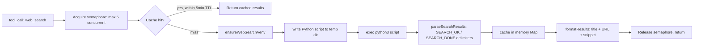

# Web Search

{: .no_toc }

[📄 README](../../.pi/extensions/web-search/README.md)

**Why.** Web search via DuckDuckGo metasearch engine — returns ranked results with titles, URLs, snippets. Designed to discover URLs for follow-up crawling with `web_crawl`. Result cache with 5-minute TTL.

**How it works.** Registers `web_search` tool. On first call, auto-creates `.pi/web-search-venv/` and installs `ddgs` from `requirements.txt`. Each call writes Python script to per-call isolated temp directory (`ignore/web-search/search-<random>/`) — prevents file races under concurrent calls. Executes via `pi.exec` bash subprocess. Results parsed from `SEARCH_OK`/`SEARCH_DONE` delimiters. Cached in memory (5-min TTL). Errors propagate as thrown exceptions for proper `isError` signaling via the framework. SIGTERM handled — Python subprocess exits cleanly with code 130 on cancellation.

**Location:** `.pi/extensions/web-search/`

## Details

### Architecture

```
├── index.ts         # Entry: tool registration, cache, concurrency semaphore
├── python-script.ts # Inline Python script (ddgs) as string constant
├── executor.ts      # runSearchScript: write temp file, exec subprocess, parse delimited output
├── venv-setup.ts    # Auto-create .pi/web-search-venv + pip install ddgs
├── types.ts         # SearchCacheEntry, SearchResult types
└── test/            # Executor + parser tests
```

### Execution Flow



### Key Design Decisions

- **Per-call isolated temp directory** — Each search writes its Python script to `ignore/web-search/search-<random>/`. Prevents file races under concurrent calls. Cleanup via SIGTERM handler when tool is cancelled.
- **Concurrency semaphore** — Max 5 simultaneous searches. Prevents overwhelming DDGS API rate limits and the venv lock file.
- **Cache TTL: 5 minutes** — In-memory `Map<string, SearchCacheEntry>` with timestamp-aware expiry. Stale entries pruned on each set. Cleared only on session boundaries.
- **Python subprocess with `ddgs`** — Uses the minimalist `ddgs` Python library (DuckDuckGo search, no browser dependency). No Puppeteer/Playwright overhead. Venv auto-created on first call.
- **Delimiter-based output parsing** — Script outputs `SEARCH_OK` / `SEARCH_DONE` markers for reliable parsing. Errors captured as `SEARCH_ERROR` blocks with message.
- **URL encoding for markdown** — `encodeUrl()` encodes parentheses `()` in URLs to prevent markdown link breakage.
- **SIGTERM handling** — Python subprocess exits cleanly with code 130 on cancellation. No orphan processes.
- **Max results bounded** — `Math.min(Math.max(1, maxResults), 50)`.

### Output Format

```markdown
Search results:

1. [Title](https://example.com)
   Snippet text here...

2. [Next Title](https://example.org)
   Snippet text here...
```

### Testing

Tests cover:
- Search result parsing from SEARCH_OK/SEARCH_DONE delimiters
- Error parsing from SEARCH_ERROR blocks
- Empty result sets
- Cache TTL expiry logic
- Venv setup retry and failure modes
