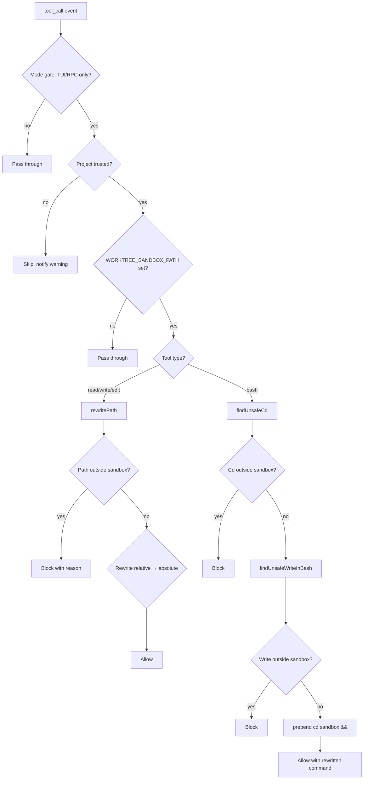

# Worktree Sandbox

{: .no_toc }

[📄 README](https://github.com/SchneiderDaniel/cheasee-pi/blob/main/.pi/extensions/worktree-sandbox/README.md)

**Why.** Enforces agents operate ONLY within their assigned git worktree — deterministic enforcement at the tool call boundary, not prompt-level. Blocks `cd` escape via variables, tilde expansion, command substitution, pipe prefix bypasses, and shell redirects outside worktree.

**How it works.** Activated by setting `WORKTREE_SANDBOX_PATH` env var. Hooks `tool_call`: `read`/`write`/`edit` rewrite relative paths to worktree root, block absolute paths outside. `bash` prepends `cd "<worktree>" && ` to every command. Shell-aware parsing via `shell-quote` detects escape vectors: variable expansion (`$HOME`) → `<HOME>`, tilde expansion (`~`) → `hasShellExpansion()`, pipe prefix (`echo | cd /escape`) → `isCommandStart()`. Also blocks file writes via redirect (`>`, `>>`), `cp`/`mv`/`touch` destinations outside worktree. Trust gate checks `ctx.isProjectTrusted()` before resolving sandbox root — prevents attacker-controlled env var from redirecting sandbox.

**Location:** `.pi/extensions/worktree-sandbox/`

## Details

### Architecture

Deterministic tool-call interception with shell-aware path analysis:

```
├── index.ts        # Entry: tool_call handler, path rewrite, shell-aware escape detection
├── shell-tokens.ts # isCommandStart, findMeaningfulToken, SEPARATORS set
└── test/           # Unit tests for all enforcement paths
```

### Enforcement Strategy



### Shell-Aware Parsing

Uses `shell-quote`'s `parse()` which correctly handles:
- Quoted strings (single and double)
- Shell operators (`&&`, `||`, `;`, `|`, `>`, `>>`)
- Comments (`# ...`)
- Variable references (`$HOME`, `$PWD`)
- Glob patterns (`*.ts`, `**/*.ts`)

### Bypass Vectors Blocked

| Vector | Example | Detection |
|--------|---------|-----------|
| Variable expansion | `cd $HOME/escape` | `hasShellExpansion()` |
| Command substitution | `` cd `escape` `` | `hasShellExpansion()` |
| Tilde expansion | `cd ~/../escape` | `hasShellExpansion()` |
| Pipe prefix | `echo \| cd /escape` | `isCommandStart()` |
| Bare cd | `cd && ./escape` | `findMeaningfulToken()` exhausted → block |
| Redirect escape | `cmd > /escape` | `findUnsafeWriteInBash()` redirect detection |
| cp/mv destination | `cp x /escape/file` | `findUnsafeWriteInBash()` command detection |
| Empty variable | `$UNSET_VAR` resolves to `""` | `isPathSafe()` with empty string |
| `cd -` | `cd -` | Returns to previous dir — always blocked |

### Key Design Decisions

- **Deterministic enforcement, not prompt-level** — Mutates tool input before execution. LLM cannot bypass because tool input mutation runs before execution. No behavioral heuristics.
- **Trust gate before sandbox root resolution** — Prevents untrusted project from controlling `WORKTREE_SANDBOX_PATH` env var to redirect sandbox to attacker-controlled paths.
- **`cd` prepend, not just blocking** — All bash commands get `cd "<worktree>" && ` prepended. Ensures working directory is always the worktree even without explicit `cd`.
- **Glob patterns detected as unsafe** — `findMeaningfulToken()` returns `{ kind: "glob" }` for tokens containing `*`, `?`, `[`. These are blocked because they could match files outside sandbox after shell expansion.
- **Mode gate** — Only enforces in TUI/RPC modes (file operations). Print/JSON mode skips to avoid `existsSync()`+`statSync()` overhead.
- **`cd -`** — Always blocked as potentially unsafe because previous directory could be outside sandbox.
- **`--` option separator handled** — `cd -- /path` correctly detects the `/path` target after `--`.

### Path Rewriting Rules

| Input path | Type | Result |
|-----------|------|--------|
| `relative/path.ts` | relative | Rewritten to `<sandbox>/relative/path.ts` |
| `/absolute/within/sandbox` | absolute (within) | Pass through unchanged |
| `/absolute/outside` | absolute (outside) | Blocked |
| `../../outside` | relative (traversal) | Blocked (resolves outside sandbox) |
| Directory path for `read` | any | Blocked with guidance to use `bash ls` instead |

### Testing

Tests cover:
- All 5 bypass vectors with real shell commands
- Path rewriting for read/write/edit (relative, absolute, traversal)
- Directory read blocking
- Trust gate (untrusted → skip, trusted → enforce)
- Mode gate (TUI/RPC vs JSON/print)
- Shell tokenization edge cases (nested quotes, escaped chars)
- Glob pattern detection in cd targets
- Empty/invalid sandbox root handling
